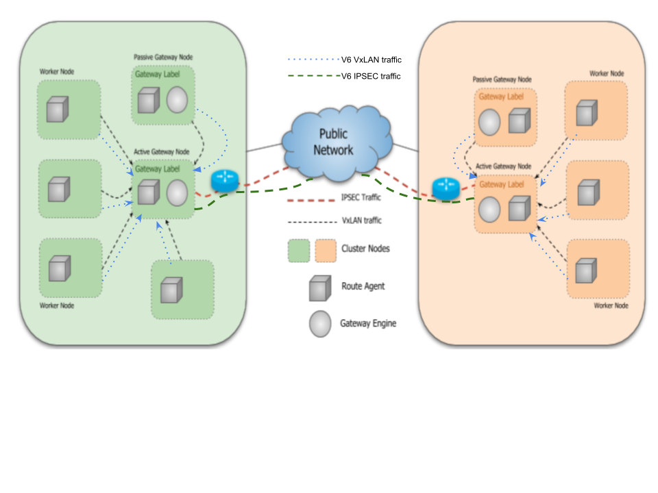
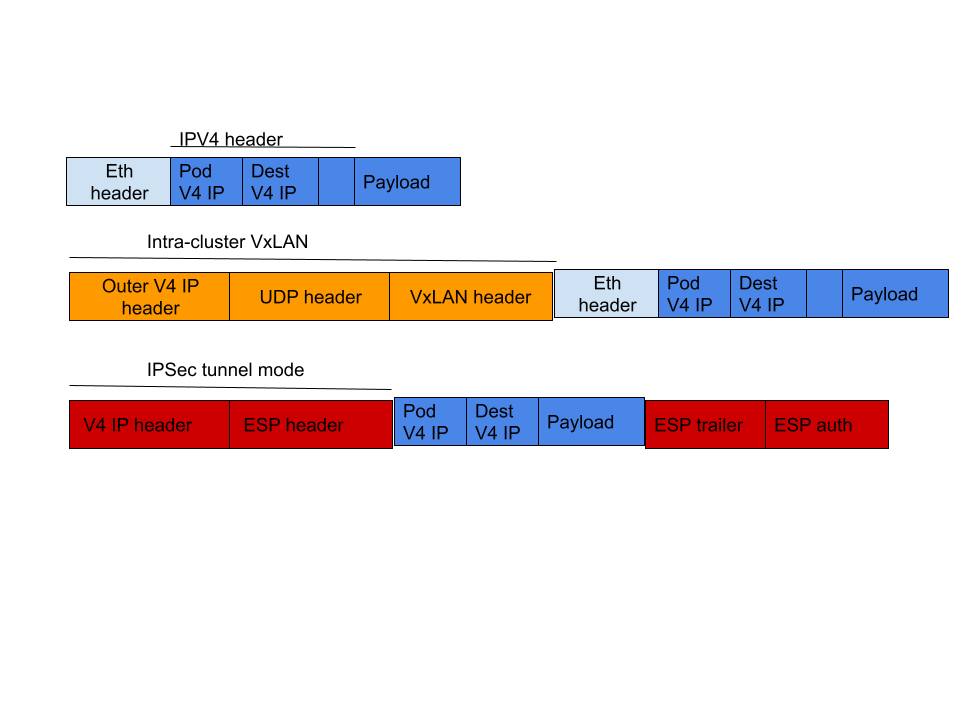
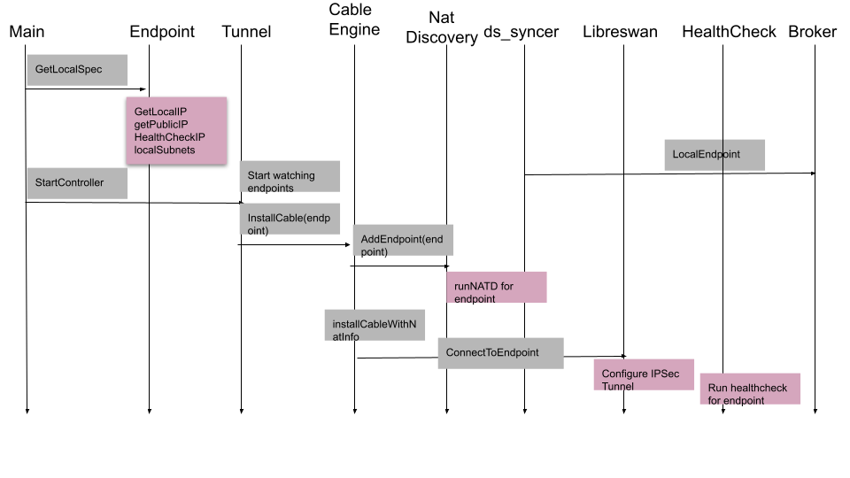

# Submariner Enhancement for IPV6 datapath

<!-- Add link to issue/epic if available -->

## Summary

IPv4, IPV6 and dual-stack networking is supported for Kubernetes cluster starting in 1.21.
IPV6 networking allowing assignment of IPv6 addresses.
Dual-stack networking allowing the simultaneous assignment of both IPv4 and IPv6 addresses.

IPv4/IPv6 dual-stack on your Kubernetes cluster provides the following features:

* Dual-stack Pod networking (a single IPv4 and IPv6 address assignment per Pod)  
* IPv4 and IPv6 enabled Services  
* Pod off-cluster egress routing (eg. the Internet) via both IPv4 and IPv6 interfaces

Currently, Submariner only supports IPV4 datapath and this proposal explains the changes required to support IPV6 and dual-stack clusters.

## Overview

Submariner’s control plane uses a central broker component to facilitate the exchange of metadata information between participating clusters.

Both inter-cluster datapath and service-discovery (Lighthouse) apply their configuration based on the information received from control plane.

The Broker, inter-cluster datapath and Lighthouse should be updated to support mixed clusters environment (e.g: dual-stack, V6 only , V4 only).

### Control plane

For mixed cluster environment, we may experience connectivity issue.
In some cases, some of the clusters and the broker may not connect.
Therefore, it is necessary to select a broker cluster with which all the clusters can communicate.

### Inter-cluster datapath

The inter-cluster datapath needs to support clusters with different networking configuration as described in the next table:

| clusterA networking | clusterB networking | Supported connectivity type |
| :---- | :---- | :---- |
| V4 | V4 | V4 |
| V4 | V6 | N/A |
| V6 | dual-stack | V6 |
| V6 | V6 | V6 |
| V4 | dual-stack | V4 |
| dual-stack | dual-stack | V4,V6 |

Verification of cluster connectivity should be added when cluster joins a clusterset.
A cluster will only be added to clusterset if it can communicate with all existing clusters in the set.

For example:

V4 cluster A should successfully join the clusterset.  
Dual-stack cluster B should successfully join the clusterset.  
V6 cluster C should fail joining the clusterset (because it can't connect to cluster A).

### Service Discovery

Lighthouse needs to handle imported services with a different IP family than the local cluster.
This is necessary in a mixed cluster environment, as described below.

|  | Local cluster networking | Imported service networking | Supported DNS record  |
| :---- | :---- | :---- | :---- |
| 1 | V4 | V4 | V4 |
| 2 | V4 | V6 | N/A |
| 3 | V6 | dual-stack | V6 |
| 4 | V6 | V6 | V6 |
| 5 | V4 | dual-stack | V4 |
| 6 | dual-stack | dual-stack | V4,V6 |

This can be accomplished by having Lighthouse ignore certain serviceImport's IP addresses.
Lighthouse should skip processing imported service IPs that don't match local cluster's networking configuration.

## Proposal

Currently, Submariner fully supports IPV4 inter-cluster connectivity.
This includes egress in-cluster routing to reach GW node, GlobalNet, and inter-cluster tunnels.

The idea is to duplicate intra-cluster and inter-cluster connectivity components also for IPV6.

The active Gateway Engine communicates with the central Broker to advertise its Endpoint and Cluster resources.
It shares these with other clusters connected to the Broker.
It also ensures that it is the sole Endpoint for its cluster.
The Endpoint resource fields should include IP addresses according to the cluster’s networking configuration.
For example for a dual-stack cluster HealthCheckIP, PrivateIP, PublicIP and Subnets should consist of both IPv4 and IPV6 addresses.  

The Route Agent running in the cluster learns about the local Endpoint and remote Endpoints.
It sets up the necessary V4,V6 infrastructure to route cross-cluster traffic from all nodes to the active Gateway Engine node.

The active Gateway Engine establishes a watch on the Broker to learn about Endpoint and Cluster resources from other clusters.
Once two clusters are aware of each other’s Endpoints, they can establish secure tunnels.
These tunnels are based on the remote and local Endpoint details, allowing traffic to be routed.
A tunnel should be created only if the local Endpoint's networking type matches the remote Endpoint's IP family.

The next diagram illustrates Submariner’s datapath architecture for kube-proxy based CNIs:

With the proposed architecture, Submariner needs to establish both V4 and V6 intra-cluster egress routing to the GW node in the case of dual-stack.

Pod IPV4 egress packets for CNI != OVNK and cable-driver=libreswan will be:

And Pod IPV6 egress packets for the same configuration will be:

For IPV4 VxLAN encapsulation we use 242.x.x.x CIDR range, a similar IPV6 CIDR should be used for IPV6 VxLAN encapsulation.

**Note**: In future, we may optimize this architecture for a dual-stack case.
For example by using only the intra-cluster V4 VxLAN to route V4 and V6 traffic to the GW.

## Datapath breakdown

### Gateway

To support IPV6 the gateway should:

* discover publicIP, privateIP, healthcheckIP and cluster’s subnets for each IP family.  
  * Note: The gateway should address corner cases related to this change.
  For example, in a dual-stack environment, only the V4 public IP address might be successfully resolved.
* run NAT Discovery per IP family in remote Endpoint.
* Advertise IP details in the local Endpoint based on the cluster's networking type.
For example, in a dual-stack cluster, both V4 Public IP and V6 Public IP should be advertised in the Endpoint.
* continue advertising a **single** Endpoint. in case of a dual-stack cluster, fields should consist of both V4 and V6 addresses separated.

**Note**: Three new fields (HealthCheckIPs, PrivateIPs, PublicIPs) should be added to the Endpoint resource to support dual-stack.
 These fields will store multiple IP addresses for dual-stack scenarios.

* create inter-cluster tunnel only if local endpoint networking type matches remote endpoint ipfamily.

  For example, in a clusterset with two dual-stack clusters (A and B).
  cluster A should maintain separate inter-cluster connection for each IP family (IPv4 and IPv6).
  The connections statuses should be visible in user-facing APIs (e.g., Gateway/status.Connections) and diagnose commands (like subctl show connections).
* Continue using IPSec in tunnel mode
* support HealthCheck for both V4 and V6 tunnels.

The next diagram describes high level flow of inter-cluster tunnel creation in GW :

The components marked in pink should be updated to support also V6.

### RouteAgent

Submariner RouteAgent is composed of several event-driven handlers.
Each handler is responsible for specific functionalities, the list below described the required changes in each handler:

#### OVN\_GwRoute handler

Creates a GatewayRoute resource for each remote endpoint.
This CR defines the routing details on the active GW node for sending traffic to remote clusters.
The OVN_GwRoute should be enhanced to create GatewayRoute resources based on the cluster's networking type.
For example, two GatewayRoute resources should be created for a dual-stack cluster.

#### OVN\_NonGwRoute handler

Similar to the OVN\_GwRoute handler, it creates a NonGatewayRoute resource for each remote endpoint.
This CR defines the routing details needed for non-GW nodes to reach the active GW node.

Additionally, OVN_NonGwRoute should be updated to create NonGatewayRoute resources based on the cluster's networking type.

#### OVN handler

The OVN handler configures routing and packetfilter rules for reaching to remote endpoints, such as NoMasquerade packetfilter rules.
OVN handler should be updated to support IPV6.

#### KubeProxy handler

The KubeProxy handler is responsible for configuring datapath required for kube-proxy based CNIs.
It configures egress routing to GW node via intra-cluster VxLAN tunnel.
This includes CNI interface discovery and setting ReversePathFilter to Loose Mode for the relevant network interfaces.
The KubeProxy handler should be updated to configure egress routing to GW node via inta-cluster VxLAN also for IPV6.

#### MTU Handler

The MTU handler is responsible for configuring MSS clamping rules for inter-cluster traffic.
MTU handler should be updated to support also IPV6 inter-cluster traffic.

#### Calico IPPool handler

This handler is relevant only for Calico CNI.
It is responsible for creating Calico IPPools to enable iner-cluster traffic, also should be updated to create IPV6 Calico IPPools when needed.

#### XRFMCleanup Handler

This handler is responsible for cleaning up IPSec xfrm rules when GW node is transitioned to non-gateway node.
It should also be updated to delete V6 IPsec xfrm rules if needed.

#### VxLANCleanup Handler

VxLANCleanup is responsible for cleaning up VxLAN cable driver routes and network interfaces when node is transitioned to non-gateway node.
It should also be updated to delete V6 VxLAN cable driver routes if needed.

#### Healthchecker Handler

The HealthChecker handler verifies the datapath from each non-gw node to each remote cluster GW.
It should be updated to support V6 datapath verification.
