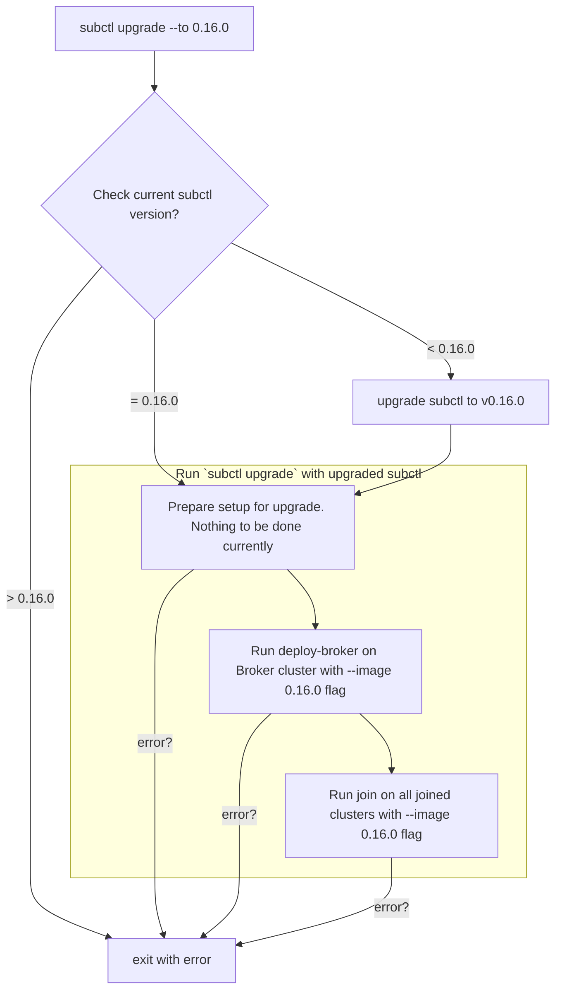

# Adding command to subctl to upgrade Submariner

Related Issue: [Add subctl upgrade command](https://github.com/submariner-io/enhancements/issues/183)

## Summary

Currently, there is no automated way to upgrade Submariner. The user needs to manually upgrade `subctl`, since the version of Submariner
to be installed is tied with the version of `subctl` installed, and then re-run `deploy-broker` and `join` sub-commands. This proposal
describes a way to automate this process.

## Proposal

The proposal is to automate the process by adding a new `upgrade` sub-command that will do the above steps in the sequence.

## Design details

* subctl command name: `upgrade`
* Flags for the command:
  * `to`: mentions the version Submariner should be upgraded to. If not specified, upgrade to the latest stable version available.
* Context to run on:
  * Check on all contexts and re-run `deploy-broker` and `join` on clusters where Broker and Submariner are installed respectively.

Once, the command is run, `subctl` will first be upgraded to the specified version. Once this is done, `subctl upgrade` will run again
with the upgraded `subctl`, if the current upgraded `subctl` version is equal to the version specified by `--to` flag, which in turn will
run `deploy-broker` on cluster where Broker is installed will be run with the `image` flag and `join` on clusters where Submariner is
installed. Exit on failure of the steps.

The upgrade process will only upgrade the `subctl` and `Submariner` version and not support changing any of the Broker or Submariner
parameters nor changing repository from where these images are pulled.

### Usage

The new command can be used as follows:

`subctl upgrade --to <version to upgarde to>`

### Alternatives

None that is automated. User will have to manually upgrade `subctl` and then re-run `deploy-broker` and `join`.

## External Dependencies

None.

## User Impact

Users would be able to automatically upgrade their Submariner deployments.
