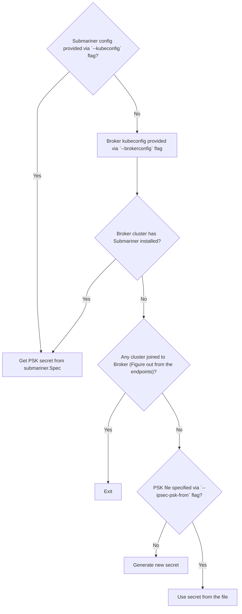

# Recover broker-info.subm file from the running Broker

Related Issue:
[Option for recovering the broker-info.subm file from a running broker cluster](https://github.com/submariner-io/enhancements/issues/143)

## Summary

`broker-info.subm` file is created when a broker is installed. The file contains information critical to have a functional environment.
There is a possibility that the file could be deleted or lost for one or the other reason. In such cases, no new clusters could be joined.

This proposal describes a way to recover the `broker-info.subm` file from the running broker.

## Proposal

A new `subctl` command will be added that would fetch needed data from the broker and write it to `broker-info.subm` file. The file
would be Base64 encoded.

## Design details

* subctl command name: `recover-brokerinfo`
* Flags for the command:
  * `brokerconfig` to specify kubeconfig of the cluster in which Broker is installed
  * `brokernamespace` to specify the namespace in which broker is installed
  * `ipsec-psk-from` to specify the file to read PSK secret from
  * All flags that `restConfigProducer` provides
    * `kubeconfig` to specify kubeconfig of the cluster in which Submariner is installed
* Data to be fetched from running broker:
  * Broker URL
  * Client token
  * IPSec PSK
  * Components installed i.e. Submariner and Service discovery
  * whether service discovery component is installed
  * default custom domains

The last three information will be retrieved from the broker `Spec`, Broker URL from the user provided broker kubeconfig, client token
from the Broker admin service account `submariner-k8s-broker-admin` and IPSec PSK with the following logic:

If Submariner is not installed in the cluster specified by the `--kubeconfig` flag, end the execution and throw an error. This addresses
the scenario where there is a cluster with Submariner in the environment but an incorrect config was provided via the flag. In such
scenario, if the execution is not stopped, a different/new PSK secret would be populated which would break the environment.

### Usage

The new command can be used as follows (assuming Submariner is installed in cluster2:

`subctl recover-brokerinfo --brokerconfig output/kubeconfigs/kind-config-cluster1 --kubeconfig output/kubeconfigs/kind-config-cluster2`

### Alternatives

None that is automated. User can always manually keep a copy of `broker-info.subm` file.

## External Dependencies

None.

## User Impact

Users would be able to retrieve information in cases where generated `broker-info.subm` file is lost.
