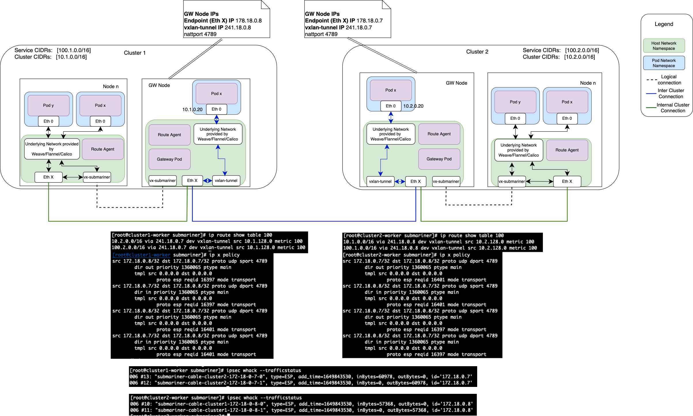

# Cable Driver Enhancement - Overlay over IPSec Transport Mode

## Status

Deferred

## Summary

Submariner today supports three cable drivers: VXLAN, IPSec (tunnel mode) and WireGuard. The
goal of this proposal is to outline the enhancements needed for the Submariner Cable Driver to
enable Overlay-over-IPSec in transport mode.

For Overlay-over-IPSec in transport mode with further configuration, the benefits fall into the
following categories:

* **Performance**: Taking advantage of an overlay protocol wrapped in offloaded IPSec in transport mode can
yield significant performance improvements. The existing IPSEC configuration performance on a pair of modern
servers ~ 2Gbit maximum. Switching to IP GRE Tunnel protected by an offloaded transport mode IPSEC external
“wrap” - 25Gbit. A difference of 12.5 times. Or in the case of VXLAN offloaded with an IPSec transport wrap - 9Gbit.
* **Scale**: While it is theoretically possible to scale a system built around tunnel mode IPSEC to hundreds of nodes,
it will be difficult to achieve reliability and stability, especially if there is a complex topology of tunnels. In
order to achieve such scales, using other L2/L3 VPN tech combined with an optional external IPSEC protection provides
a better approach, because it allows the use of dynamic routing protocols instead of complex static routing. Furthermore,
it allows the use of traffic engineering and Site to Site QoS which is impossible in the case of IPSEC Tunnel mode.
* **Debuggability**: Tunnel mode IPSEC is a debugging nightmare (especially if it is offloaded in part or in full). There
is no visibility of what goes into the VPN and once it has entered the tunnel it is encrypted and thus unsuitable for debugging.
This problem goes away if the VPN is using standard L2/L3 VPN technology which provides suitable interfaces on which the system
administrator can snoop.

## Proposal

This enhancement proposes to extend the available IPSec offering in Submariner to also provide
transport mode support coupled with the supported overlay protocols (VXLAN). This
could provide end-to-end security while greatly reducing the performance overhead of tunnel mode
secured tunnels for certain scenarios. In terms of implementation, this would require the addition
of Libreswan cable driver configuration parameters to `submariner.io_submariners.yaml`:

```yaml
    ceIPSecMode:
        type: string
    ceIPSecOverlay:
        type: string
```

> **_NOTE:_**
>
> * mode: values can be transport or tunnel (default).
> * overlay: values can be vxlan (the supported encapsulation drivers in Submariner).

The other option would be to create a new (optional) ConfigMap for cable driver configuration and
add this map to the `submariner.io_submariners.yaml` - this would allow for more detailed
configurations to be passed to the cable drivers moving forward without having to extend
the Submariners CRD beyond the addition of the ConfigMap:

```yaml
cableDriverCustomConfig:
  properties:
    configMapName:
      type: string
```

The ConfigMap could be kept relatively simple where keys follow the naming convention:
`ceDriverNameParam`. An example is shown below:

```yaml
apiVersion: v1
kind: ConfigMap
metadata:
  name: cabledriver-config
data:
  ceCustomConfig: |
    ceIPSecMode: "transport",
    ceIPSecOverlay: "vxlan",
    ceIPSecPfsGroup: ["modp2048"]
    ceIPSecEsp: ["aes_gcm-null"]
```

On the invocation of the `NewLibreswan()` function the configuration params
are read to establish if the request is for a tunnel or transport based
connection. If the connection is transport based - then the `libreswan` driver
will need to also drive the VXLAN Cable Driver as well as the setup, and
teardown of the IPSec connections. The existing VXLAN configuration will be the
same.

An example configuration (that would need to be done by the driver) for a VXLAN over
IPSec Transport connection between two Submariner clusters gateways cluster1-worker
(172.18.0.8) and cluster2-worker (172.18.0.7):

> **_NOTE 1:_** This section assumes that Submariner was deployed with the VXLAN cable driver and adjusted the nattport to 4789
> To use the default Submariner nattport 4500 the argument to clientprotoport needs to be adjusted to udp/4500
> **_NOTE 2:_** The IPSec secret using the Submariner PSK needs to be configured in the usual way.

<!-- markdownlint-disable line-length -->
```console
[root@cluster1-worker]# ipsec whack --psk --encrypt --forceencaps --name submariner-cable-cluster2-172-18-0-7-0 --host 172.18.0.8 --clientprotoport udp/vxlan --ikeport 4500 --to --host 172.18.0.7 --clientprotoport udp --ikeport 4500
[root@cluster1-worker]# ipsec whack --psk --encrypt --forceencaps --name submariner-cable-cluster2-172-18-0-7-1 --host 172.18.0.8 --clientprotoport udp --ikeport 4500 --to --host 172.18.0.7 --clientprotoport udp/vxlan --ikeport 4500
[root@cluster1-worker]# ipsec whack --route --name submariner-cable-cluster2-172-18-0-7-0
[root@cluster1-worker]# ipsec whack --route --name submariner-cable-cluster2-172-18-0-7-1
[root@cluster1-worker]# ipsec whack --initiate --asynchronous --name submariner-cable-cluster2-172-18-0-7-0
[root@cluster1-worker]# ipsec whack --initiate --asynchronous --name submariner-cable-cluster2-172-18-0-7-1
```

```console
[root@cluster2-worker]# ipsec whack --psk --encrypt --forceencaps --name submariner-cable-cluster1-172-18-0-8-0 --host 172.18.0.7 --clientprotoport udp/vxlan --ikeport 4500 --to --host 172.18.0.8 --clientprotoport udp --ikeport 4500
[root@cluster2-worker]# ipsec whack --psk --encrypt --forceencaps --name submariner-cable-cluster1-172-18-0-8-1 --host 172.18.0.7 --clientprotoport udp --ikeport 4500 --to --host 172.18.0.8 --clientprotoport udp/vxlan --ikeport 4500
[root@cluster2-worker]# ipsec whack --route --name submariner-cable-cluster1-172-18-0-8-0
[root@cluster2-worker]# ipsec whack --route --name submariner-cable-cluster1-172-18-0-8-1
[root@cluster2-worker]# ipsec whack --initiate --asynchronous --name submariner-cable-cluster1-172-18-0-8-0
[root@cluster2-worker]# ipsec whack --initiate --asynchronous --name submariner-cable-cluster1-172-18-0-8-1
```
<!-- markdownlint-enable line-length -->

> **_NOTE:_** The clientprotoport parameter is used to specify the Port Selectors (filters) to be used on this connection.
> The general form is protocol/port.

The resulting topology is shown below


### Hardware offload enablement

_"libreswan as of version 3.23 supports the new cryptographic hardware offload as implemented by Linux 4.11 and up using the
native (XFRM) IPsec stack. Libreswan autodetects supports for any hardware supporting this crypto offload API"_ [1].

The [NICs](https://libreswan.org/wiki/Cryptographic_Acceleration#Supported_hardware) that support Hardware offload capabilities
for Libreswan are pretty standard and available in all cloud environments. Submariner encourages the 'selection' of one these
NICs for a node where one intends to deploy the Submariner gateway and leverage the use of labels to schedule the pod to the
appropriate node: a node label for the node that has the right NIC and for the GW pod to use a label selector (for that node label)
to ensure that the gateway lands on the right platform. Then rely on Libreswan to autodetect the HW features and take advantage of them.

> **_NOTE:_** The IPSec cable driver will need to be modified to run `ipsec _stackmanager start` to load the appropriate
> hardware offload modules.

## TODO (@yboaron)

* Since one of the advantages of transport mode is performance, it is worth mentioning that better performance is achieved mainly
by HW offload and HW offload is only relevant when SM runs on a node connected to a physical NIC (eg: k8s node == baremetal server).
* The proposal allows flexibility by letting SM control the overlay over IPSec in transport mode, so we have IP/ESP/Overlay.

These are all cool, but I think we need to understand:

Which SM use cases might benefit from having a flexible overlay
What are the required changes in SM components
For example, to configure inter-cluster routes dynamically instead of the current method (static routes using the information
from the broker), SM needs to configure an overlay (ie VxLAN), and a dynamic routing instance needs to run in each cluster.

This information will help us understand the need for this feature and the required efforts.

## References

[1] [Cryptographic_Acceleration](https://libreswan.org/wiki/Cryptographic_Acceleration)
