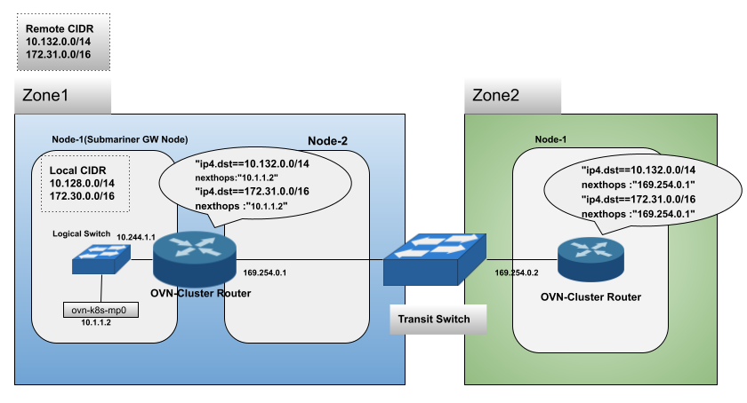

# Submariner Enhancement for OVN Interconnect

<!-- Add link to issue/epic if available -->

## Summary

OVN CNI is moving to a new network topology powered by OVN Interconnect Feature. This allows independent OVN deployments to be interconnected
by OVN-managed GENEVE tunnels. Submariner does not work with these changes out of the box and this proposal explains the changes required to
support it.

## Proposal

With OVN Interconnect we can have two types of deployment

* Single Zone(Global Zone): A single-zone deployment will have only one OVN database and a set of master nodes programming it. This is similar
  to the topology that we use now. But it will have a single `global` zone assigned to it with a transit switch which is not involved in any
  packet forwarding. Though this setup is expected to work by default, the subnet that the transit switch used overlaps with the subnet
  Submariner uses for the logical router. In this proposal, we plan to remove the submariner router and the associated switches and this will
  not be a problem anymore. The below indicates node annotations in a single zone  OVN setup.

```bash
    annotations:
      k8s.ovn.org/ovn-node-transit-switch-port-ips: '["169.254.0.1/16"]'
      k8s.ovn.org/ovn-zone: global
    name: cluster1-worker

    annotations:
      k8s.ovn.org/ovn-node-transit-switch-port-ips: '["169.254.0.1/16"]'
      k8s.ovn.org/ovn-zone: global
    name: cluster2-worker
```

* Multiple Zone: In a multiple-zone setup, we will have an OVN database and a set of master nodes for each zone. Transit switches connect the
  zones. The OVN-Kubernetes services ensure that the necessary routes are added for pod and service reachability across nodes in different
  zones.

```bash
    annotations:
      k8s.ovn.org/ovn-node-transit-switch-port-ips: '["169.254.0.3/16"]'
      k8s.ovn.org/ovn-zone: global
    name: cluster1-worker

    annotations:
      k8s.ovn.org/ovn-node-transit-switch-port-ips: '["169.254.0.5/16"]'
      k8s.ovn.org/ovn-zone: az2
    name: cluster2-worker
```

With the current architecture, Submariner adds routes only in the zone in which it is deployed. For example, if Submariner is deployed in
zone 1 it programs OVN db in zone 1. So only pods in zone 1 nodes will be able to talk to other clusters. Pods in zone 2 or zone 3 will not
be able to reach remote clusters connected via Submariner.

### Route APIs

As a part of this proposal, we are planning to add two new CRDs in Submariner

#### SubmarinerGwRoute

This CR will be created when a remote endpoint is added and there will be one CR per remote cluster. This crd have two fields

* NextHop - Specifies the next hop to reach the remote cluster.
* RemoteCIDR - Specifies the list of  remote CIDRS reachable via this cluster.

This CR will be used by the gateway pod to program OVN to send the traffic destined to remote clusters to the Submariner tunnel.

``` go
type SubmarinerGwRouteList struct {
  metav1.TypeMeta `json:",inline"`
  metav1.ListMeta `json:"metadata"`

  Items []SubmarinerGwRoute `json:"items"`
  }

type SubmarinerRoutePolicySpec struct {
    //Specifies the next hop to reach the remote CIDRs
    NextHop string `json:"nextHop"`

    //Specifies the remote CIDRs available via the next hop
    RemoteCidr []string `json:"remoteCidr"`
}
```

#### SubmarinerDefaultRoute

This CR will be created when a remote cluster is connected. When more remote clusters are added the Remote CIDR list will be updated.

* NextHop - Specifies the next hop.
* RemoteCIDR - Specifies the list of remote CIDRs reachable via this gateway.

This CR will be used by the Routeagent pods to

* In non-g/w node - send the traffic to the g/w node , if the current node is in a different zone
* In g/w node - add route to send the traffic from other zones, destined to remote cluster to the submariner tunnel

``` go
type SubmarinerDefaultRouteList struct {
    metav1.TypeMeta `json:",inline"`
    metav1.ListMeta `json:"metadata"`

    Items []SubmarinerDefaultRoute `json:"items"`
}

type SubmarinerRoutePolicySpec struct {
    //Specifies the next hop to reach the remote CIDRs
    NextHop string `json:"nextHop"`

    //Specifies the remote CIDRs available via the next hop
    RemoteCidr []string `json:"remoteCidr"`
}
```

## Design Details

In this proposal, the plan is to remove the Submariner router and switches that it add to OVN db. The network-plugin-syncer shall be removed
and can be replaced by controllers in Submariner Gateway and Submariner RouteAgent. Since we have multiple ovn db to program, we need multiple
connections. So it makes it easier to program the OVN datapath from Submariner Gateway and RouteAgent, than using a separate pod.
This new approach will work for both IC enabled and existing deployments. With this change we are planning to use the  ovn-k8s-mp0 interface
to reach the host networking stack and then the Submariner tunnel. This interface is used by OVN for host-networking traffic with in a cluster
and will be present in every node.



### SubmarinerGatewayPod

The Submariner g/w pod will be responsible for creating the SubmarinerGWRoute CR. It will be used only for OVN CNI right now. For every
RemoteEndpointCreated event a SubmarinerGWRouteCR will be created. The nextHop will be the interface IP through which we can reach the cable
driver. In the case of OVN it will be the IP of ovn-k8s-mp0 interface.

The SubmarinerDefaultRoute CRD will also be created by Submariner Gateway. It will have the list of remote clusters connected to the gateway.
The nexthop will be the transit switch IP of the G/W node. If the transit switch IP is missing this CRD will not be created, which means it is
a non-IC setup.

#### SubmarinerGWRouteCR Controller

This controller will be responsible for programming the OVN cluster router, and it shall be a part of Submariner g/w pod. When a SubmarinerGWRoute
CR is created  or modified the controller shall create or update a routing policy in OVN cluster router with a priority of 20000, and it should
redirect any traffic destined to remote CIDR to the ovn-k8s-mp0 interface IP.

```bash
_uuid               : 0459f009-3603-47ac-8ee7-9d958540ed31
bfd                 : []
external_ids        : {}
ip_prefix           : "242.1.0.0/16"
nexthop             : "10.244.1.2"
options             : {}
output_port         : []
policy              : []
route_table         : ""
```

#### SubmarinerRouteAgentPod

The Routeagent will have a new controller added to it

##### SubmarinerDefaultRouteController

This controller will run in every in route agent. This controller connects to the OVN DB. When a SubmarinerDefaultRoute CR is created

* non-gateway node : it updates the DB with a router policy with a priority 20000 to send the traffic to the remote cluster via next hop
  mentioned, which is the transit switch IP to the g/w node. Before adding the route it checks if a route exists, if so it skips adding the
  route again. This is required to prevent duplicate update since there can be more than one node in each zone and hence more than one
  Routeagent.

```bash
_uuid               : 22db3005-64c5-4e32-aeb0-642423c30742
action              : reroute
external_ids        : {}
match               : "ip4.dst==242.1.0.0/16"
nexthop             : []
nexthops            : ["169.254.0.1"]
options             : {"external_ids:{submariner"="true}"}
priority            : 20000
```

* gateway node/same zone node : In the gateway node route agent adds a route, if it does not exist, to send the traffic coming from other
  zones which is destined to remote cluster IP range to the ovn-k8s-mp0 interface IP. It checks if the rule already exists to prevent duplicate
  update.

```bash
_uuid               : d55185d8-3732-45c1-ae90-4a7f8cd191f7
bfd                 : []
external_ids        : {}
ip_prefix           : "242.1.0.0/16"
nexthop             : "10.244.1.2"
options             : {}
output_port         : []
policy              : []
route_table         : ""
```

### Backward Compatibility

With this architecture, we are removing the logical switches and routers that Submariner creates. During migration, we will need to delete
these components and the routes that network-plugin-syncer installed. After that, the new controllers shall install the updated routes.

### Alternatives

#### Adding extra routes

We explored a proposal for adding an extra routes in the existing architecture. This would mean adding same extra routes as in this proposal
but by maintaining the submariner switches and router. While this should be easier to implement this be maintenance overhead in the future.

#### Route Advertisement

Another alternative was explored which could leverage the [route advertisement](
https://docs.ovn.org/en/latest/tutorials/ovn-interconnection.html#route-advertisement) feature in OVN. The idea was to use this capability
to advertise Submariner routes. But this feature seems to be not available in the OVN Kubernetes IC implementation.

## External Dependencies

These OVN changes should be merged for OVN Interconnect support in the CNI

[Add cluster manager support](https://github.com/ovn-org/ovn-kubernetes/pull/3127)

[Add zone support](https://github.com/ovn-org/ovn-kubernetes/pull/3169)

[Multiple zone support](https://github.com/ovn-org/ovn-kubernetes/pull/3366)

## User Impact

The user should be able to use Submariner in OVN enabled setups as well the non-IC ones. The pods that the user see when a Submariner is deployed
will change and similar change can be expected in diagnose command outputs.
