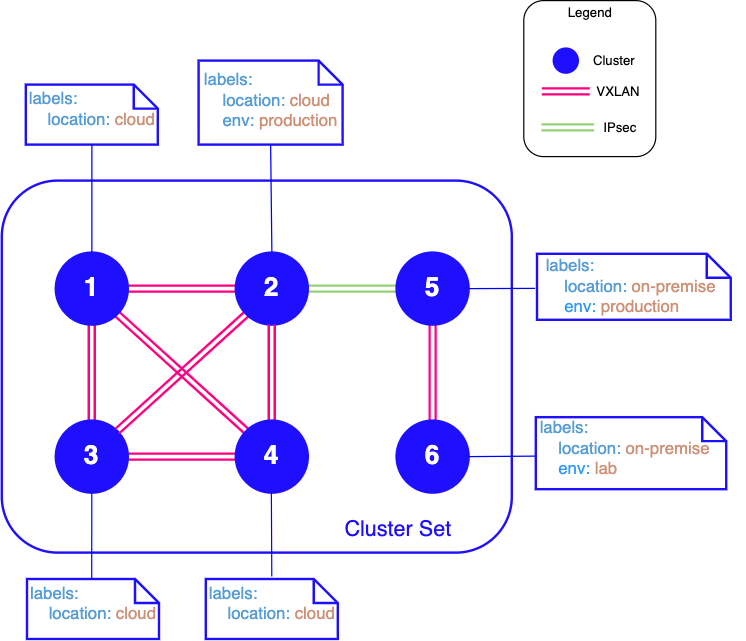

# Cable Driver Policy Support

## Summary

Submariner currently offers three cable drivers: VXLAN, IPSec or wireguard. However only one of these cable drivers
is enabled across all the clusters in a ClusterSet; That is all clusters that join a broker must use the same cable
driver. The goal of this proposal is to extend the current model to support the selection of different cable types
between connected clusters.

There are use cases that involve supporting a mix of cable drivers or cable driver configurations within the same
ClusterSet. For example, a ClusterSet could contain three clusters, two that are on-premise and the other
in a public cloud. Connections to the cloud cluster will need to use encryption while the on-premise clusters can use
unencrypted connections, as they’re connected by a private link, to avoid the performance overhead of encryption.

## Proposal

This enhancement proposes a new policy CRD to allow users to selectively deploy different cable types between clusters
in a ClusterSet. The proposal assumes that connection between two clusters is symmetrical. If Cluster A is connected
to Cluster B via a VXLAN cable type - then Cluster B is connected to Cluster A via a VXLAN cable type and not another
cable type.

This enhancement will propose a single API for cable driver policy support using custom resource definition (CRDs).

### Cable driver policy API

This following CRD is proposed:

```Go
type ClusterConnectionPolicy struct {
    metav1.TypeMeta `json:",inline"`

    metav1.ObjectMeta `json:"metadata,omitempty"`

    ClusterConnectionPolicySpec `json:"spec"`

    // Status is the current state of the ClusterConnectionPolicy.
    Status ClusterConnectionPolicyStatus `json:"status,omitempty"`
}

type ClusterConnectionPolicySpec struct {
    // LeftClusterSelector identifies the Cluster resources representing the clusters on one end of a connection. An empty
    // selector indicates wildcard, ie matches any cluster.
    LeftClusterSelector metav1.LabelSelector `json:"leftClusterSelector,omitempty"`

    // RightClusterSelector identifies the Cluster resources representing the clusters on the other end of a connection.
    // An empty selector indicates wildcard, ie matches any cluster.
    RightClusterSelector metav1.LabelSelector `json:"rightClusterSelector,omitempty"`

    // Name of the cable driver implementation to use for this connection.
    CableDriverName string `json:"CableDriverName"`
}
```

The `ClusterConnectionPolicy` CR defines the criteria for selecting which cable driver to use to connect cluster pairs (or subsets).
To resolve the connectivity policy for a remote cluster's Endpoint, Submariner would:

- Search for a policy whose left and right label selectors match the corresponding Cluster resources of the local
  and remote Endpoints.

If any matching policy is found, the clusters are connected using the cable driver specified in the cable driver policy.

If no matching policy is found, the `default` cable driver policy is used. The `default` policy can be auto-created at broker
deploy time.

> **_NOTE:_** In the case of multiple labels being specified, the selector will need to match all the labels.
> Inequality-based requirements will be supported. For e.g. labels such as `env: !production` will match any clusters
> that aren't labelled with `env: production`.

The initial `ClusterConnectionPolicy` resources would be created and maintained on the broker cluster and synced to each
participating cluster.

Submariners `EndpointSpec` should be extended to include a map that identifies of the policies used to connect to clusters. The key
is the remote ClusterID and the value is the policy name.

New parameters `Backends` and `BackendsConfig` would also need to be added to the `EndpointSpec`.

> **_NOTE:_** `Backend` and `BackendConfig` could be deprecated in favour of the new `EndpointSpec` parameters.

```go
type EndpointSpec struct {
  // +kubebuilder:validation:MaxLength=63
  // +kubebuilder:validation:MinLength=1
  ClusterID string `json:"cluster_id"`
  CableName string `json:"cable_name"`
  // +optional
  HealthCheckIP      string            `json:"healthCheckIP,omitempty"`
  Hostname           string            `json:"hostname"`
  Subnets            []string          `json:"subnets"`
  PrivateIP          string            `json:"private_ip"`
  PublicIP           string            `json:"public_ip"`
  NATEnabled         bool              `json:"nat_enabled"`
  Backend            string            `json:"backend"`
  BackendConfig      map[string]string `json:"backend_config,omitempty"`
  // Backends lists all the enabled backends on an endpoint: vxlan, ipsec ...
  Backends           []string          `json:"backends"`
  // Backends config is a map listing the configuration for a particular backend:
  // e.g. 
  //    backends_config:
  //      vxlan:
  //        Natt - Discovery - Port:  4490
  //        Preferred - Server:       false
  //        Udp - Port:               4500
  BackendsConfig     map[string]map[string]string `json:"backends_config,omitempty"`
  // ConnectionPolicies is a map listing the cluster connection policies applied
  // e.g. 
  //    connection_policies:
  //      cluster1:
  //        backend:  vxlan
  //        policy:   default
  ConnectionPolicies map[string]map[string]string `json:"connection_policies,omitempty"`
}
```

### Labelling clusters

Clusters are defined as Custom Resources and can be labeled in the CRD. A new parameter to label clusters at
`subctl join` time could also be added for usability purposes.

#### Connection Policy Examples

- We want to specify a default policy that uses IPsec as the default cable driver.

```yaml
kind: ClusterConnectionPolicy
metadata:
  name: default
  namespace: submariner-operator
spec:
  cableDriver:
    name: "ipsec"
```

- We want to use specific cable drivers to connect clusters in a ClusterSet as shown in the image below. We
label the `Clusters` appropriately and define a number of policies with the appropriate label selectors.



```yaml
kind: ClusterConnectionPolicy
metadata:
  name: default
  namespace: submariner-operator
spec:
  cableDriver:
    name:  "vxlan"
```

```yaml
kind: ClusterConnectionPolicy
metadata:
  name: on-prem-to-cloud
  namespace: submariner-operator
spec:
  leftClusterSelector:
    env: cloud
  rightClusterSelector:
    env: on-premise
  cableDriver:
    name:  "ipsec"
```
