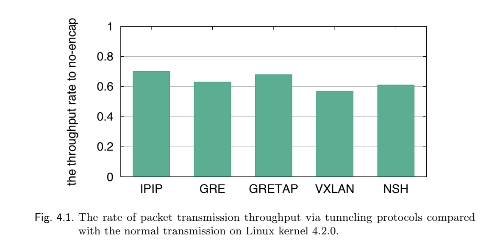
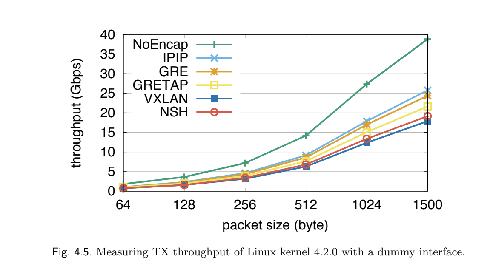
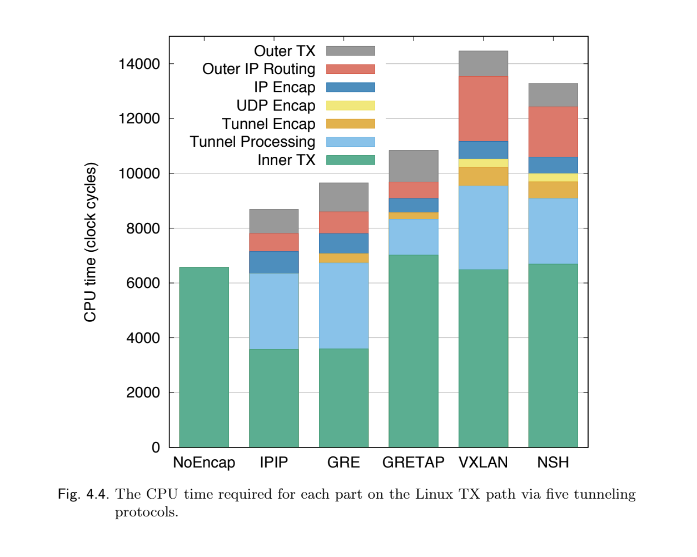
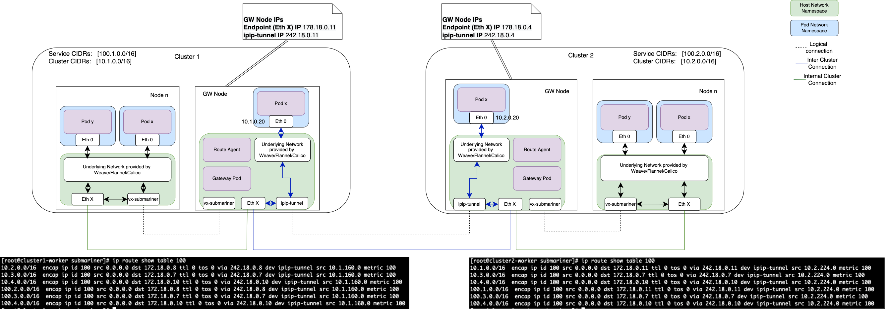

# Cable Driver Protocol Support Enhancements

## Summary

Submariner today supports three cable drivers: VXLAN, IPSec (tunnel mode) and WireGuard. The
goal of this proposal is to outline additional protocols and enhancements for the Submariner
Cable Driver. These include the additional support of IP-in-IP for unencrypted connections
between clusters and the support of IPSec transport mode.

For IP in IP, the benefits fall into the following categories:

* **Performance**: IP in IP is has a lower overhead than VXLAN which could lead to performance
improvements in terms of packet overhead (bandwidth consumption) as well as the cost of processing
packets. Some of the performance improvements are shown below [1]:

  * 
  * 
  * 

* **Interoperability**: IP in IP can be used to transport packets between domains when the protocol
in those domains (e.g. IPv6) is not supported by intermediary networks (e.g. IPv4).

For Overlay-over-IPSec in transport mode with further configuration, the benefits fall into the
following categories:

* **Performance**: Taking advantage of an overlay protocol wrapped in offloaded IPSec in transport mode can
yield significant performance improvements. The existing IPSEC configuration performance on a pair of modern
servers ~ 2Gbit maximum. Switching to IP GRE Tunnel protected by an offloaded transport mode IPSEC external
“wrap” - 25Gbit. A difference of 12.5 times. Or in the case of VXLAN offloaded with an IPSec transport wrap - 9Gbit.
* **Scale**: While it is theoretically possible to scale a system built around tunnel mode IPSEC to hundreds of nodes,
it will be difficult to achieve reliability and stability, especially if there is a complex topology of tunnels. In
order to achieve such scales, using other L2/L3 VPN tech combined with an optional external IPSEC protection provides
a better approach, because it allows the use of dynamic routing protocols instead of complex static routing. Furthermore,
it allows the use of traffic engineering and Site to Site QoS which is impossible in the case of IPSEC Tunnel mode.
* **Debuggability**: Tunnel mode IPSEC is a debugging nightmare (especially if it is offloaded in part or in full). There
is no visibility of what goes into the VPN and once it has entered the tunnel it is encrypted and thus unsuitable for debugging.
This problem goes away if the VPN is using standard L2/L3 VPN technology which provides suitable interfaces on which the system
administrator can snoop.

## Proposal

### IP-in-IP Encapsulation

This enhancement proposes to support IP-in-IP for un-encrypted connection between clusters. A
new IP tunnelling interface `ipip-tunnel` will be added to the active gateway node of each cluster
and it will act as the Tunnel End Point. The traffic which is destined to other clusters will be
forwarded via this interface to the appropriate clusters.

> **_NOTE:_** A single IP Tunnelling interface will be added, and tunnels managed using
`# ip route add encap ip <args>` in order to avoid a point to point connection per tunnel.

#### Design Details

* A new interface "ipip-tunnel" will be added.
* The IP tunnelling interface will be one-to-many, that is a single interface will be used to
connect to all the joined clusters.
* For the "ipip-tunnel" IP, the prefix "243" will be used, followed by the rest of the blocks
from the endpoint private IP address. For example, if the private IP address is 10.2.96.1 the
"ipip-tunnel" IP would be 243.2.96.1.
* The routes will be added to forward all the Service and Pod CIDR traffic to the respective
remote Tunnel IPs.
* Table 150 shall be used to add the routes for inter-cluster communication.

Example of routeing rules added by the IPTun driver on a gateway node to other nodes

```console
ip route add 10.2.0.0/16 encap ip id 100 dst 172.18.0.21 via 243.18.0.21 dev ipip0 table 100 metric 100 src 10.1.96.0
ip route add 100.2.0.0/16 encap ip id 100 dst 172.18.0.21 via 243.18.0.21 dev ipip0 table 100 metric 100 src 10.1.96.0
ip route add 10.3.0.0/16 encap ip id 100 dst 172.18.0.8 via 243.18.0.8 dev ipip0 table 100 metric 100 src 10.1.96.0
ip route add 100.3.0.0/16 encap ip id 100 dst 172.18.0.8 via 243.18.0.8 dev ipip0 table 100 metric 100 src 10.1.96.0
ip route add 10.4.0.0/16 encap ip id 100 dst 172.18.0.4 via 243.18.0.4 dev ipip0 table 100 metric 100 src 10.1.96.0
ip route add 100.4.0.0/16 encap ip id 100 dst 172.18.0.4 via 243.18.0.4 dev ipip0 table 100 metric 100 src 10.1.96.0
```

and the resulting routes on the gateway node:

```console
[root@cluster1-worker submariner]# ip route show table 100
10.2.0.0/16  encap ip id 100 src 0.0.0.0 dst 172.18.0.8 ttl 0 tos 0 via 243.18.0.8 dev ipip-tunnel src 10.1.160.0 metric 100
10.3.0.0/16  encap ip id 100 src 0.0.0.0 dst 172.18.0.7 ttl 0 tos 0 via 243.18.0.7 dev ipip-tunnel src 10.1.160.0 metric 100
10.4.0.0/16  encap ip id 100 src 0.0.0.0 dst 172.18.0.10 ttl 0 tos 0 via 243.18.0.10 dev ipip-tunnel src 10.1.160.0 metric 100
100.2.0.0/16  encap ip id 100 src 0.0.0.0 dst 172.18.0.8 ttl 0 tos 0 via 243.18.0.8 dev ipip-tunnel src 10.1.160.0 metric 100
100.3.0.0/16  encap ip id 100 src 0.0.0.0 dst 172.18.0.7 ttl 0 tos 0 via 243.18.0.7 dev ipip-tunnel src 10.1.160.0 metric 100
100.4.0.0/16  encap ip id 100 src 0.0.0.0 dst 172.18.0.10 ttl 0 tos 0 via 243.18.0.10 dev ipip-tunnel src 10.1.160.0 metric 100
```

A high level view of the topology is shown in the diagram below:


> **_NOTE:_** IP-in-IP has a lower processing and bandwidth overhead than VXLAN.

## References

[1] Ryo NAKAMURA, Improving Packet Transport in Virtual Networking by Encapsulation Techniques
<https://repository.dl.itc.u-tokyo.ac.jp/record/51086/file_preview/A34115.pdf>
