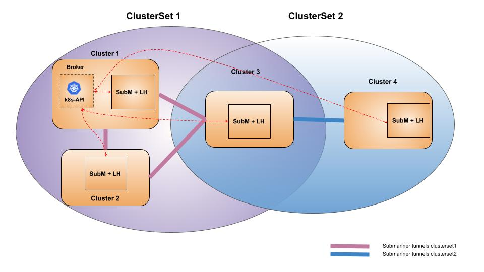

# Fine Grained Connectivity

## Summary

Submariner currently provisions full mesh topology by default between the participating clusters.
For some use-cases, we need fine-grained connectivity options. This proposal covers only the topology
aspect of connectivity.

This proposal aims to address the below use-case

Hub-Spoke Topology -  Here only the client can talk to the server but not to the other clients to
which the server is connected to.

To achieve each hub and spoke will be grouped together into an isolated group of clusters called Clusterset.
There will be a full mesh topology within the Clusterset, though in this use case it will be just two clusters
in the Clusterset. A cluster can be a part of multiple Clusterset. So the hub can be a part of multiple
Clustersets, where it connects with a spoke in each Clusterset

## Proposal

### Terminology

#### Clusterset

A Clusterset is a group of clusters that forms a trust boundary. The design of Clusterset can be aligned
to the MCS KEP. More details are available in the below link.

[Cluster-Id KEP]: http://www.reddit.comhttps://github.com/kubernetes/enhancements/tree/master/keps/sig-multicluster/2149-clusterid

In this proposal, we intend to use only the ClusterId(which exists already) and ClusterSet as a part of
Submariner Cluster CRD. The ClusterClaim API shall be realized once the KEP is finalized upstream.

### Design Details



The Submariner should be enhanced to support grouping of clusters into Clustersets. The Cluster CRD can
be enhanced to hold the Clustersets name in which the cluster is a part of. The one or more Clustersets
the cluster wants to be a part of shall be specified when the cluster joins the broker. If no
Clustersets are specified, the default will be used. The cluster-id should be unique across Clustersets.

```Go

type Cluster struct {
        metav1.TypeMeta   `json:",inline"`
        metav1.ObjectMeta `json:"metadata,omitempty"`
        Spec              ClusterSpec `json:"spec"`
}

type ClusterSpec struct {
        ClusterID   string   `json:"cluster_id"` // perhaps this could just be a hash of the name...?
        ClusterSets []string `json:"cluster_sets"`
        ServiceCIDR []string `json:"service_cidr"`
        ClusterCIDR []string `json:"cluster_cidr"`
        GlobalCIDR  []string `json:"global_cidr"`
}
```

#### Submariner Broker

There will be a single broker running in one of the participating clusters. The clusters will specify
the Clusterset it wants to be a part of when it joins the broker. A cluster can be a part of multiple Clustersets.
The broker ensures that resources are only synced within a Clusterset.

#### Service Discovery

The broker ensures that the ServiceImports are synced only within the Clustersets. So a cluster should be a
part of the Clusterset from which the service was exported to receive the service import.  But the same
service in the same namespace across Clustersets would be considered an instance the same service.

#### Dataplane Connectivity

Similar to service imports endpoint objects are synced only within the Clustersets. A full mesh of tunnels
will be created within the members of the Clustersets. If a cluster is a part of two Clusterset multiple
tunnels will be created.

#### GlobalNet

Global net currently allocates CIDR per cluster. So across Clustersets each cluster will have non-overlapping CIDR.

## Alternatives

One broker per Clusterset: With multiple brokers either we need multiple Submariner components each having its own
namespace and talk to a specific broker or we need to have a submariner component talking to multiple brokers.
Either option requires changes across Submariner and Lighthouse. A significant change will be required in the
submariner-operator and deployment as well.
