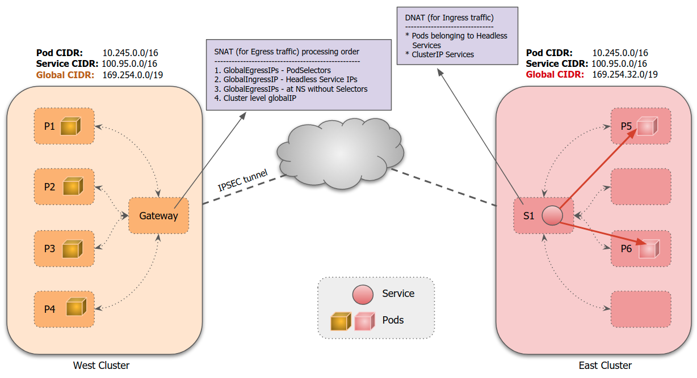
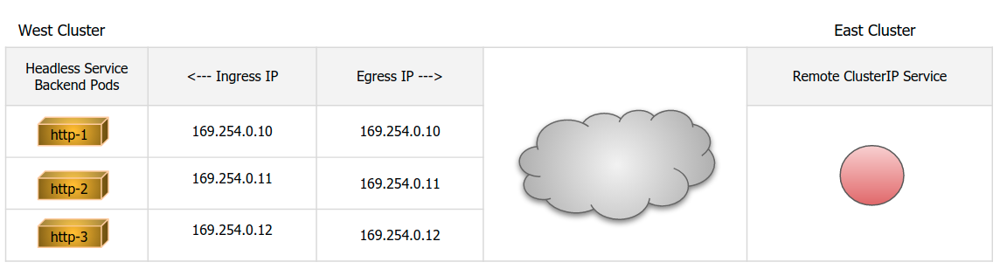
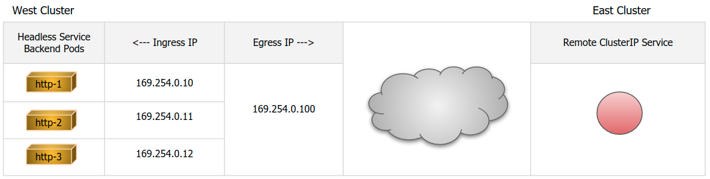

## Globalnet 2.0: Enhancements to Globalnet Implementation

## Summary

Currently, Submariner Globalnet implementation in [release 0.8](https://github.com/submariner-io/releases/releases/tag/v0.8.0)
annotates every Pod, Service and Node in the cluster with a globalIP to support Pod to remote
Service connectivity in the following manner.

Once a Pod is scheduled and enters Running state, it is annotated with a globalIP. To support
the connectivity, Globalnet programs the necessary egress rules on the active Gateway Node of
the cluster where the source IP of the Pod is modified to the corresponding globalIP. This
translation enables us to uniquely identify the traffic from the Pod, when it reaches the
destination cluster.

Similarly, a ClusterIP Service is annotated with a globalIP so that remote Pods can communicate
with it using its globalIP. Globalnet programs the necessary ingress rules on the active Gateway
node of the cluster, where the service resides. The ingress rules enable any incoming traffic
destined to the globalIP of the Service to be redirected to the corresponding ClusterIP Service.

In order to support connectivity from the Host Network to the remote services, Globalnet also
annotates every node in the cluster with a unique globalIP.

While this works fine for small clusters, where the number of Pods and Services are limited, for
large clusters it poses scalability and performance issues as we would eventually run out of
globalIPs because of annotating every Pod/Service/Node object. Also, in this design, Pod to Pod
connectivity as well as Headless Services are not supported.

## Proposal

This enhancement proposes the following changes to make Globalnet implementation scale better.

Egress traffic:

* By default, every cluster will be assigned a configurable number of globalIPs which will be
  used as egress IPs for any cross-cluster communication. Support for more than a single globalIP
  at the cluster level is done to avoid ephemeral port exhaustion issues.
* Provision to allocate a set of globalIPs at the namespace/project level which takes precedence
  over the globalIPs allocated to the cluster. All Pods in the namespace will use the same globalIPs
  as EgressIPs.
* Provision to allocate globalIPs to a Pod (or a set of Pods) from the selected namespaces or
  from any namespace. Such Pods will use globalIPs that take precedence over any globalIPs allocated
  at the default namespace level.

Ingress traffic:

* Instead of annotating every ClusterIP Service in the cluster, only exported Services will be
  annotated with a globalIP.
* For Headless Services, necessary ingress rules will be programmed to support connectivity to
  the backend Pods. In a Headless Service use-case, every backend Pod will be annotated with
  a unique globalIP as an Ingress IP. Clients can discover the associated globalIP using
  Lighthouse and can connect to the globalIP assigned to the backend pods.
  For Pods backed by Headless Services, if the user does not explicitly request a globalIP via
  GlobalnetEgressIP CRD, the same globalIP assigned to the Pods will be used for both Ingress
  as-well-as Egress. However, if user creates a GlobalnetEgressIP that matches the namespace,
  or the backend pods of Headless Service, the globalIP assigned via GlobalnetEgressIP takes
  precedence over individual Pod globalIPs as EgressIP.



If the external application in a remote Cluster is interested in consuming the exported
Service, it will have to reach the globalIP assigned to the exportedService and the response
from the backend Pods will have the source as the globalIP of the exportedService.

On the other hand, when the backend Pod tries to talk to the external application in remote
Cluster, the external application will see that traffic is coming with a globalIP that is
assigned either at the Cluster level, or namespace level, or the one requested by the user
at Pod level. This asynchronous behavior will be analogous to the behavior seen with standard
K8s applications when they talk to any Services. Applications desiring to have the same IPaddress
for both ingress and egress traffic can create Headless Services in front of them and should
avoid requesting explicit globalIP that match Headless Service backend Pods.

The proposal has its own set of Pros and Cons.

### Pros

Since we will be annotating only select K8s objects with globalIP, it will help in improved scalability.
Also, this translates to fewer iptable rules on the active Gateway node of the cluster which will
improve the overall performance of the solution.

### Cons

A limitation with the proposed approach is that we will lose the unique identity for **every**
Pod which is supported today. For users that intend to use Network Policies across Clusters or
for debugging purposes, this can be mitigated by creating the necessary GlobalnetEgressIP CRDs
which create unique globalIPs at the Namespace/Pod level.

### Caveats

In the current implementation, when a client Pod is scheduled, until it's annotated with a globalIP,
and the corresponding egress rules are programmed on the node, it was not able to communicate with
remote Services. This was creating some issues in-terms of user-experience. In this proposal, as we
have a globalIP at the cluster level, a Pod can communicate with remote Services right away which
will be closer to the Vanilla Submariner experience.

## Design Details

The following CRD is proposed to support the new design.

```Go
type GlobalnetEgressIP struct {
    metav1.TypeMeta   `json:",inline"`
    metav1.ObjectMeta `json:"metadata,omitempty"`

    // Spec is the specification of desired behavior of GlobalnetEgressIP object.
    Spec               EgressIPSpec `json:"spec"`

    // Observed status of GlobalnetEgressIP. Its a read-only field.
    // +optional
    Status             EgressIPStatus `json:"status,omitempty"`
}

type EgressIPSpec struct {
    // GlobalIPs is a list of EgressIPs requested. The requested globalIPs should be part
    // of globalCIDR of the Cluster. If the requested globalIPs are not allocated to other
    // K8s objects, then it will be allocated and the status field will be updated accordingly.
    // If the globalIPs are already allocated to other objects, creation of the CRD will fail.
    // If this field is not specified, a single globalIP will be allocated.
    // This field cannot be changed through updates.
    // +optional
    GlobalIPs  []string `json:"globalIPs,omitempty"`

    // Selects the Namespaces to which this GlobalnetEgressIP object applies.
    // If an empty namespaceSelector: {} is configured, it selects all the Pods in all namespaces.
    // On the other hand, if you omit specifying namespaceSelector, it does not select any
    // namespaces and selects only Pods from the namespace where the GlobalnetEgressIP is
    // deployed to.
    // +optional
    NamespaceSelector metav1.LabelSelector `json:"namespaceSelector,omitempty"`

    // Selects the pods whose label match the definition. This is an optional field and
    // in case it is not set, it results in all the Pods selected from the NamespaceSelector.
    // In case it is set, its intersected with NamespaceSelector, and only Pods that match the
    // PodSelector and present in the NamespaceSelector will have the GlobalIPs as EgressIPs.
    // Either namespaceSelector or podSelector have to be specified. If both are omitted,
    // its considered as an error.
    // When a Pod or Namespace matches multiple GlobalnetEgressIP objects, there is no guarantee
    // which of the globalIP address that are assigned to GlobalnetEgressIP will be used.
    // +optional
    PodSelector metav1.LabelSelector `json:"podSelector,omitempty"`
}

const (
    // GlobalnetEgressIPSuccess means that Globalnet was able to successfully
    // allocate the GlobalIP as requested in GlobalnetEgressIP object.
    GlobalnetEgressIPSuccess GlobalnetEgressIPStatus = "Success"

    // GlobalnetEgressIPError means that Globalnet was unable to allocate the
    // GlobalIP for the requested GlobalnetEgressIP object.
    GlobalnetEgressIPError GlobalnetEgressIPStatus = "Error"
)

type EgressIPStatus struct {
    // Status is one of {"Success", "Error"}
    Status GlobalnetEgressIPStatus `json:"status,omitempty"`

    // +optional
    Message *string `json:"message,omitempty"`

    // The list of GlobalIPs assigned via this GlobalnetEgressIP object.
    GlobalIPs []string `json:"globalIPs"`

    // The Namespaces to which the GlobalIPs are applied.
    Namespaces []string `json:"namespaces"`

    // The Pods to which the GlobalIPs are applied.
    Pods []string `json:"pods"`
}
```

Creation of GlobalnetEgressIP object will be controlled via a ClusterRole and only users having
the necessary role will be able to create the objects. The GlobalnetEgressIP object can be
created in any namespace with selectors that match any other namespaces.

### Backward Compatibility

Inorder to support the newer implementation, a combination of ipSets with multiple IPTable chains
will be used. Also, we will require two annotations, one for ingressGlobalIP and the other for
egressGlobalIP. Because of this, backward compatibility cannot be maintained with the existing
implementation of Globalnet.

### User Stories

1.User has two (or more) clusters with Overlapping CIDRs and requires the Pods in one
  Cluster be able to discover and talk to exported Services.

  To achieve this use-case, user can simply deploy Submariner Globalnet on all the participating
  clusters. By default, a globalIP (or a set of globalIPs) will be assigned at the Cluster level
  which will be used as egressIPs for inter-cluster communication and necessary Services can be
  exported.

2.In a Globalnet deployment user wants the Pods in a namespace `ns1` to use a unique globalIP
  instead of the globalIP assigned at the cluster level.

  To achieve this, one can apply the following CRD.

```yaml
   apiVersion: submariner.io/v1alpha1
   kind: GlobalnetEgressIP
   metadata:
     name: ns-egressip
   spec:
     namespaceSelector:
       matchLabels:
         project: ns1
     globalIPs:
       - "169.254.1.30"
```

3.In a Globalnet deployment user wants the Pods in a namespace `ns1` to use unique globalIPs
  instead of the globalIPs assigned at the cluster level.

To achieve this, one can apply the following CRD.

```yaml
   apiVersion: submariner.io/v1alpha1
   kind: GlobalnetEgressIP
   metadata:
     name: ns-egressip
   spec:
     namespaceSelector:
        matchLabels:
          project: ns1
     globalIPs:
       - "169.254.1.30"
       - "169.254.1.32"
       - "169.254.1.40"
```

4.In a Globalnet deployment, user wants a selected Pod (or set of Pods) in a particular namespace
  to use a unique globalIP as egressIP for cross-cluster communication.

  To achieve this, one can apply the following CRD.

```yaml
   apiVersion: submariner.io/v1alpha1
   kind: GlobalnetEgressIP
   metadata:
     name: db-pods
     namespace: ns1
   spec:
     namespaceSelector:
       matchLabels:
         project: ns1
     podSelector:
         matchLabels:
           role: db
```

5.In a Globalnet deployment, user wants a selected Pod (or set of Pods) in a particular namespace
  to use a unique globalIP both as ingress and egressIP for cross-cluster communication.

  To achieve this, user can create a Headless Service (backed by a Deployment or StatefulSets) and
  Globalnet will ensure that all the backend Pods that belong to the Headless Service are assigned
  a globalIP. User is also expected **not** to create any GlobalnetEgressIP object which selects the
  backendPods that match the Headless Service.



  In the above example, each of the http pods will get its own globalIP which can be used for
  both ingress and egress communication.

  However, if the user wants egress traffic from the http Pods to carry a unique globalIP,
  its possible by explicitly requesting a GlobalnetEgressIP with PodSelectors matching Headless
  Service Pods as shown below.

```yaml
   apiVersion: submariner.io/v1alpha1
   kind: GlobalnetEgressIP
   metadata:
     name: http-pods
     namespace: myproject
   spec:
     namespaceSelector:
       matchLabels:
         project: ns1
     podSelector:
       matchLabels:
         app: http
   status:
     globalIPs:
      - 169.254.0.100
```



## Alternatives

It is possible to support Pod to Pod communication even with Globalnet. However, to support this, it
requires programming additional IPtable rules on the nodes which will have an impact on the performance
of the solution. This proposal provides some limited Pod to Pod connectivity via the Headless Services.
If user is interested in Pod to Pod communication for all the Pods, it is recommended to install
Clusters with non-overlapping CIDRs and use Vanilla Submariner instead of Globalnet.

## Work items

1. Support creation of GlobalnetEgressIP CRD and the associated Cluster Roles.
2. Provide configuration parameter either via ConfigMap or Env variable to specify
   the number of default GlobalIPs that have to be allocated at cluster level.
3. Support Globalnet EgressIPs at the cluster level and program necessary egress rules.
4. Support Globalnet EgressIPs at namespace level which takes precedence over
   globalIPs at cluster level.
5. Support Globalnet EgressIPs to Pods (or set of Pods) which has the highest precedence.
6. Annotate only exported Services instead of annotating all Services.
7. Support Headless Services and program ingress/egress rules for the backend Pods.
8. Avoid dependency on the iptable chains programmed by IPtables kube-proxy driver.
9. Implement necessary unit tests for each of the use-cases.
10. Implement necessary e2e tests to validate various use-cases.
11. Update documentation.
12. Support upgrade from 0.8 release to the newer implementation.
