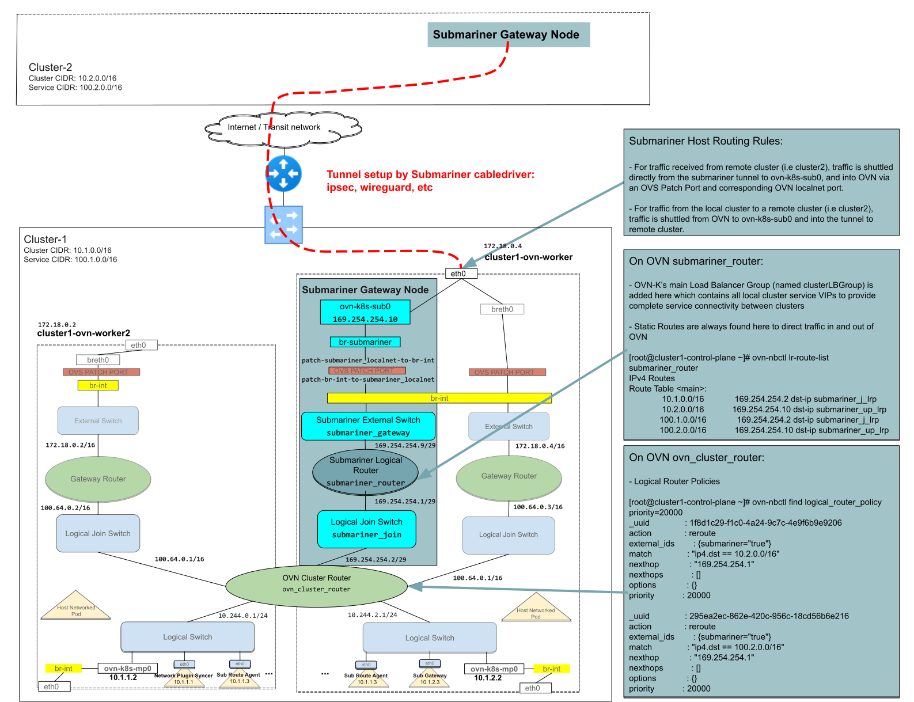

# Globalnet support for OVN-Kubernetes CNI

Related Issue:
[Submariner Globalnet Support with OVN-Kubernetes CNI](https://github.com/submariner-io/enhancements/issues/97)

## Summary

The current implementation of Globalnet controller in [release 0.13](https://github.com/submariner-io/releases/releases/tag/v0.13.0)
supports CNIs that use Kube-proxy configured with IPtables backend. However, it does not support OVN-Kubernetes CNI.
There is a growing interest to support Globalnet with OVN-Kubernetes CNI. Also, considering that Vanilla Submariner
supports OVN-Kubernetes it's important to fill this feature parity.

## Proposal

This enhancement proposes that we continue with the current design of Globalnet based on IPtables/IPsets even with
OVN-Kubernetes. In order to get all the Globalnet features working, we will require a couple of changes in Network
Plugin Syncer code as well as OVN Route agent handler.

## Design Details

Before talking about the changes, let us understand the current design of Globalnet and Submariner support for OVN-Kubernetes.

Globalnet controller programs necessary SNAT/DNAT rules on the active Gateway node using IPtable rules.
It uses a combination of IPsets and IPtable rules in the `nat` table to support Cluster scoped GlobalEgressIPs,
Namespace scoped GlobalEgressIPs, Pod specific GlobalEgressIPs and GlobalIngressIPs for Headless Services.
For more details, you can refer to the following [enhancement proposal](./globalnet-enhancement2-0.md) and the
corresponding [documentation](https://submariner.io/getting-started/architecture/globalnet/).

On the other hand, Submariner supports OVN-Kubernetes in the following manner.

1. [Network Plugin Syncer (NPS)](https://submariner.io/getting-started/architecture/networkplugin-syncer):
   * The NPS runs as a K8s deployment with a replica count of 1.
      It is primarily used to interact with the OVN-Kubernetes CNI and is responsible for creating a networking
   topology in the OVN to route the remote cluster traffic via the active Gateway node.
   * It achieves this by creating a logical `submariner_router`, `submariner_gateway` and `submariner_join` switches
   in the OVN pipeline and associates the OVN-K's main Load Balancer Group (named clusterLBGroup) to the
   `submariner_router` to provide service connectivity between the clusters.
   * When a remote endpoint notification is received by the NPS controller, it programs Logical Router Policies in
   `ovn_cluster_router` to redirect the remote cluster traffic via the logical `submariner_router`.
   * Similarly, when a local endpoint notification is received by the NPS controller, it looks at the hostname info,
   pins the `submariner_router` to the chassis of the active Gateway node and programs Logical Routes on the
   `submariner_router` to redirect incoming traffic from the remote-cluster to the `ovn_cluster_router` on the
   Gateway node.

2. OVN Handler in Route Agent:
   * It creates the `br-submariner` bridge with an internal interface `ovn-k8s-sub0` configured with `169.254.254.10`
   IP address. This is done on all the worker nodes, but it's mainly used on the Gateway node alone.
   * Similarly, it creates `SUBMARINER-POSTROUTING` chain in the `nat` table and `SUBMARINER-FWD-MSSCLAMP`/`SUBMARINER-FORWARD`
   chains in the `filter` table.
   * On the active Gateway node of the cluster, these chains are programmed with necessary IPtable rules to allow the
   inter-cluster traffic.
   * When a remote endpoint notification is received by the handler, it programs routes in `table 150` on all the
   worker nodes with default next hop present on the `ovn-k8s-mp0` interface.
   Basically, this is done to support pods with hostNetworking to connect to a remote service.
   The idea here is to send the traffic via the CNI network and not via the default interface on the host.
   * Similarly, on the Gateway node, it programs
     * routes in `table 149` to redirect the incoming traffic from the remote cluster via the `submariner_router` and
     * IPtable rules in `SUBMARINER-POSTROUTING` chain of `nat` table not to perform any NAT operation on this traffic.

So, in the Submariner OVN architecture the inter-cluster traffic touches the host before leaving the Gateway node via
the tunnel. Because of this, we can leverage the current Globalnet design which programs the iptable rules on the
Gateway node even for OVN-Kubernetes deployments.

Also, OVN-Kubernetes controller itself uses IPtables for the following use-cases.

* For supporting NodePort based services.
* For supporting regular clusterIP services configured with `external-ips`, the OVN controller programs IPTable rule
in `PREROUTING` chain of `nat` table to perform DNAT operation from `external-ip` to the corresponding `cluster-ip`
associated with the service.

Given that both Submariner and OVN-Kubernetes already use iptables for a couple of use-cases, this option is the
most suitable and safe option among the ones we evaluated for supporting OVN-Kubernetes deployments.

### Changes

The following fixes are necessary in Submariner to support Globalnet on OVN-Kubernetes clusters.

* [Missing rule in SUBMARINER-POSTROUTING chain](https://github.com/submariner-io/submariner/issues/1981)
* [Missing default route in table 150 on all the worker nodes](https://github.com/submariner-io/submariner/issues/1982)
* [Redirect the ingress traffic to a cluster via the submariner_router](https://github.com/submariner-io/submariner/issues/1983)
* [Fix logical routes programmed in submariner_router](https://github.com/submariner-io/submariner/issues/1984)

### Pros

* Since the same Globalnet code will be used even for OVN-Kubernetes, it will be easy to maintain.
* Any enhancements/fixes that go into Globalnet controller will benefit all the CNIs.
* It will take less effort to support Globalnet for OVN-Kubernetes deployments.

### Cons

* Nothing in particular.

### Backward Compatibility

Now to support this, we require a couple of changes in Network Plugin Syncer and OVN route-agent plugin code.
However, these changes will be made in such a way that it will work for both Vanilla Submariner deployments and
Globalnet deployments without creating any regressions.

### Alternatives

Apart from the approach described above, we also evaluated the following two options.

* **Use OpenFlow rules:** Since, `br-submariner` is not managed by OVN, we can directly program OpenFlow rules on the
  switch to perform SNAT/DNAT operations for GlobalEgressIPs/GlobalIngressIPs.
  * This requires us to identify and use a golang based library, a new dependency, that allows us to program openflow
  rules on the switch.
  * We will have to replicate whatever we do with IPtables/IPSets using OpenFlow pipeline and OpenFlow rules.
  Since OpenFlow does not support IPSets or its equivalent, we have to create individual openflow rules to support
  certain GlobalEgressIP use-cases which makes the solution less optimal.
  * Also, while debugging any issues, one should be familiar with IPtables, OpenFlow rules and OVN flows to be able to
  narrow down and fix it.

* **Create multiple instances of Logical Routers:**
  * Currently, OVN Logical Routes do not support priority. Because of this, we cannot use Logical Routes, programmed
  on `submariner_router`, to perform SNAT operation in a specific priority order.
  So, we will have to create multiple instances of Logical Routers where each instance is responsible for supporting
  GlobalEgressIPs at a particular level (i.e., Cluster scope, Namespace scoped etc) and use Logical Router Policies
  with priority on `ovn_cluster_router` to steer the associated traffic to the respective Logical Router.
  * On top of that, since there is no support for IPSet equivalent that can be used as part of Logical Router Policies,
  we will have to program individual Logical Router Policies on `ovn_cluster_router` to steer the traffic, which makes
  the solution less optimal and very complex to maintain.

## External Dependencies

None

## User Impact

None
