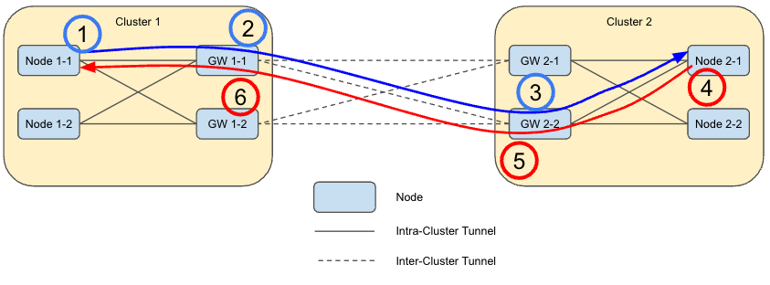

# Multiple Active Gateways

## Summary

NOTE: The design details are still a work in progress, so this is currently a draft proposal.

Submariner currently only allows a single gateway to be active at any one time in a given cluster.
This enhancement proposes that there be an option to allow more than one gateway to be active in
a given cluster to enhance both performance and resiliency. This feature is sometimes referred to as
“active-active gateways”; however, the goal is to allow two or more actove gateways to be used.

## Proposal

The proposal is to optionally allow multiple gateways to be active at the same time in a given cluster.

When only a single active gateway is used, all inter-cluster traffic must flow through that one gateway,
which creates a performance bottleneck. Enabling more than one node to be used as a gateway can improve
the performance linearly in the number of gateways used.

Additionally, when the active gateway fails in the current implementation, work must be done to switch
over to the new gateway including the establishment of new tunnels (both intra-cluster and inter-cluster)
and new routes, which takes time. With the proposed design, It is expected that the fail-over times can
be significantly improved if additional gateways are operational. Furthermore, it is expected that
traffic flowing through operational gateways will continue to flow while the traffic from the failed
gateway is redirected to the operational gateways. Both properties reduce the impact of a failure.

## Design Details

### Single Gateway

In the current single gateway Submariner implementation, intra-cluster VXLAN tunnels are established by
the non-gateway nodes to the gateway node, and each gateway establishes an inter-cluster tunnel to each
other gateway in the clusterset (with the tunnel type determined by the cable driver in use) as shown
below.

### Multiple Active Gateway Design

The proposal for supporting multiple active gateway nodes is shown in the following diagram and described below.

* Each non-gateway node will establish a VXLAN tunnel to each gateway node.
* The non-gateway nodes will load-balance flows between the active gateway nodes.
* Each gateway node will establish a tunnel to each peer gateway node.
* The gateway nodes will load-balance flows between the active peer gateway nodes.
* Load balancing will be performed using Linux resilient nexthop groups.

### Multiple Active Gateway Packet Flow

An example packet flow is shown in the following diagram and described below.

1. Node 1-1
    1. Intercept packet destined for global service
    2. Load balances flow to gateway 1-1
    3. Hash ensures remaining packets in the connection also go to gateway 1-1
2. Gateway 1-1
    1. Determines packet is destined for Cluster 2 based on dest Globalnet IP
    2. Load balances flow to Gateway 2-2
    3. Perform SNAT from local source/port to one of the Globalnet address/ports for gateway 1-1
    4. Hash ensures that remaining packets in the flow also go to Gateway 2-2
3. Gateway 2-2
    1. The packet is handed off to the local service load balancer, which performs necessary NAT
operations and forwards the packet to chosen endpoint on Node 2-1.
4. Node 2-1
    1. Send response back to Gateway 2-2 (through service load balancer)
    2. Note: it should be okay if the return path uses a different gateway, but I think the cluster
load balancer will return it to the same node in order to maintain the NAT state.
5. Gateway 2-2
    1. Forward back to Gateway 1-1 over the appropriate tunnel
    2. Note: It is important that Gateway 2-2 forwards the packet directly to Gateway 1-1 and not
via the nexthop load balancer which may send it to Gateway 1-2. This can be accomplished by using host
routes for the gateway IP addresses that are higher priority than the routes for the cluster Globalnet
CIDRs which would use the nexthop load balancing.
6. Gateway 1-1
    1. Perform DNAT from the global address back to the local address
    2. Send to the pod on Node 1-1 via local CNI.

## Notes and Assumptions

* This design assumes that Globalnet is being used. It may be possible to make it work without Globalnet if
necessary, but step 5 relies on the fact that the dest IP will be the address for the correct gateway.
Without Globalnet, we’d still need to do the same type of SNAT operation at step 2 using local addresses
which isn’t currently done by Submariner.

* The initial POC will use standard external IP addresses for gateways, but load balancer mode is
a high priority for the final implementation.

* The initial design and POC is focused on non-ovn-kubernetes CNIs, but ovn-kubernetes must also be supported.

* There will be a config option to enable multiple active gateways, and when enabled, all nodes labeled with
“submariner.io/gateway=true” will become active. It is for future study whether we should support an option
where we support more than one active gateway as well as additional backup inactive gateways.

## Plan

The plan is to implement a POC based on this design, and then update the design as needed.
