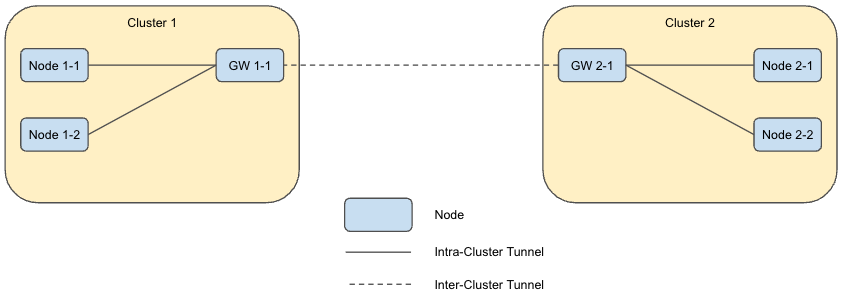
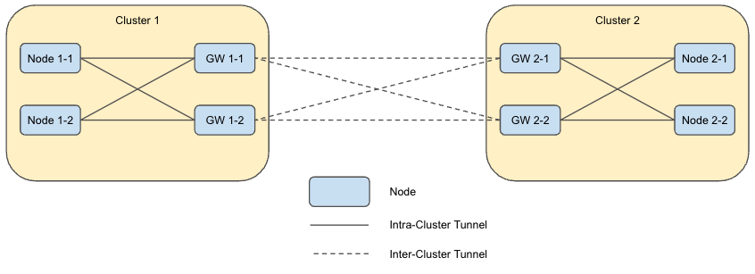
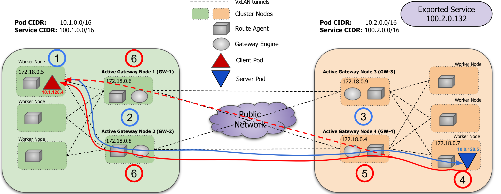
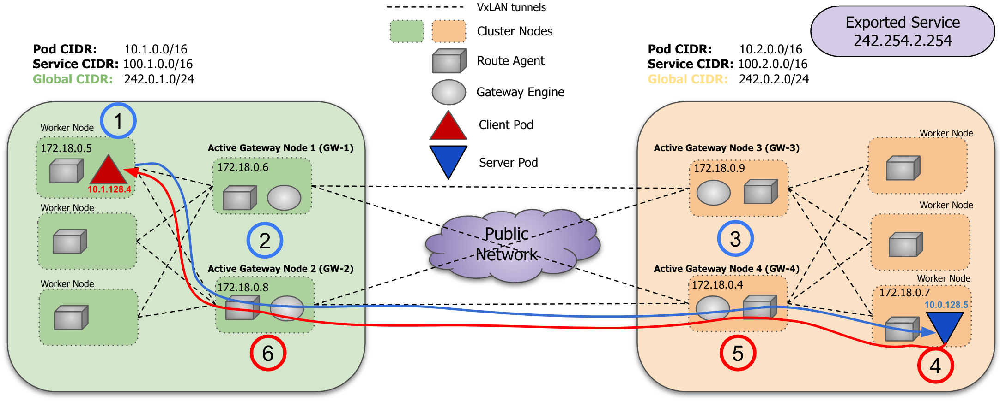
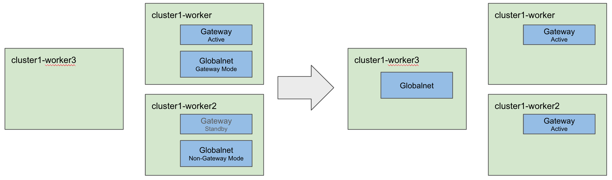

# Multiple Active Gateways

## Summary

Submariner currently only allows a single gateway to be active at any one time in a given cluster.
This enhancement proposes that there be an option to allow more than one gateway to be active in
a given cluster to enhance both performance and resiliency. This feature is sometimes referred to as
“active-active gateways”; however, the goal is to allow two or more active gateways to be used.

## Proposal

The proposal is to optionally allow multiple gateways to be active at the same time in a given cluster.

When only a single active gateway is used, all inter-cluster traffic must flow through that one gateway,
which creates a performance bottleneck. Enabling more than one node to be used as a gateway can improve
the performance linearly in the number of gateways used.

Additionally, when the active gateway fails in the current implementation, work must be done to switch
over to the new gateway including the establishment of new tunnels (both intra-cluster and inter-cluster)
and new routes, which takes time. With the proposed design, It is expected that the fail-over times can
be improved if additional gateways are operational. Furthermore, it is expected that
traffic flowing through operational gateways will continue to flow while the traffic from the failed
gateway is redirected to the operational gateways. Both properties reduce the impact of a failure.

## Design Overview

### Single Gateway

In the current single gateway Submariner implementation, intra-cluster VXLAN tunnels are established by
the non-gateway nodes to the gateway node, and each gateway establishes an inter-cluster tunnel to each
other gateway in the clusterset (with the tunnel type determined by the cable driver in use) as shown
below.



### Multiple Active Gateway Design

The proposal for supporting multiple active gateway nodes is shown in the following diagram and described below.



#### Summary of Data Plane Changes

* Each non-gateway node will establish a VXLAN tunnel to each gateway node.
* The non-gateway nodes will load-balance flows between the active gateway nodes.
* Each gateway node will establish a tunnel to each peer gateway node.
* The gateway nodes will load-balance flows between the active peer gateway nodes.

#### Load balancing options

Multiple options for load balancing exist.

* Option 1: The one currently supported by vishvananda/netlink, and implemented in the POC, is to include multiple next
  hops in each route using the "nexthop" option.
* Option 2: A more efficient option is to use nexthop groups.  They are more efficient because multiple routes can use the same
  nexthop group, and when the nexthop group changes, you only need to update the group object and not all of the routes
  that use it. A good discussion can be found
  [here](https://lpc.events/event/4/contributions/434/attachments/251/436/nexthop-objects-talk.pdf).
* Option 3: Resilient nexthop groups are an even better option because they reduce the churn that happens when flows hash to new
  links after a nexthop group changes. A good overview of resilient nexthop groups can be found
  [here](https://docs.kernel.org/networking/nexthop-group-resilient.html).

nexthop groups are not currently supported by vishvananda/netlink, so that support would need to be added upstream
and then pulled into Submariner before it makes sense to use them for Submariner.  Furthermore, resilient next hop group
support was only added in kernel version 5.13 and iproute2 version 5.10, so a fairly recent Linux distribution is required.
Therefore, we would most likely use Option 1 in the short term.

## Design Details

### Multiple Active Gateway Packet Flow without Globalnet

An example packet flow with Globalnet disabled, is shown in the following diagram and described below.



1. Traffic leaves pod destined for Imported Service (100.2.0.132) and is sent to one of the gateways (**GW-2** here) over
the intra-cluster VxLAN Tunnel via a multipath route on the worker node:

   ```shell
    Routing Table Default: 100.2.0.0/16 proto static
                  nexthop via 240.18.0.6 dev vx-submariner weight 1
                  nexthop via 240.18.0.8 dev vx-submariner weight 1
    ```

    `SRC: 10.1.128.4  DST: 100.2.0.132`

2. Traffic reaches local GW node (**GW-2**) and is routed towards one of the remote gateways (**GW-3** or **GW-4**) over
the inter-cluster VxLAN Tunnel via a multipath route on the gateway node:

    ```shell
    Routing Table 100: 100.2.0.0/16 src 10.0.0.1 metric 100 pervasive
                       nexthop via 241.18.0.4 dev vxlan-tunnel weight 1
                       nexthop via 241.18.0.9 dev vxlan-tunnel weight 1
    ```

    `SRC: 10.1.128.4  DST: 100.2.0.132`

3. Traffic reaches remote GW node (**GW-4**):

   a. DstIP of the packet is the Cluster IP of the exported k8s service, so the traffic is DNAT’ed by the CNI to a backend Pod IP:

    ```shell
    -A KUBE-SEP-WWP6UFXXL5K3PY6D -p tcp -m comment --comment "default/submariner-lpq6zr4tl4o5qvrv2t7o3l3gawkagast" 
    -m tcp -j DNAT --to-destination 10.0.128.5:80
    ```

    `SRC: 10.1.128.4  DST: 10.0.128.5`

   b. If the pod isn’t on the GW node (**GW-4**), the return packets need to flow back through this node because the
connection tracking state for step 3-a only exists on this node. To do this, the traffic is SNAT’ed to the IP address of
the Node’s main CNI interface so that traffic returns via the same gateway. For this setup the Weave CNI is used so service
DNAT is handled by kubeproxy. NOTE: The packet should only be SNAT'ed if the state is DNAT (from step 3-a). This is because
we don't want a similar SNAT to occur in step 6. The IPtables rule looks something like:

   ```shell
    -A SUBMARINER-POSTROUTING -i vxlan-tunnel -o weave -m conntrack --ctstate DNAT -j SNAT --to-source 10.2.192.0
    ```

    `SRC: 10.2.192.0  DST: 10.0.128.5`

   c. Routed to the Dst node by the CNI.

    `SRC: 10.2.192.0  DST: 10.0.128.5`

4. Traffic is delivered to the destination pod via the CNI, and sent back to the correct local GW node (**GW-4**) via the
CNI due to the SNAT completed in step 3-b.

    `SRC: 10.0.128.5  DST: 10.2.192.0`

5. Traffic arrives back at the same GW node (**GW-4**) it entered on:

   a. Traffic is DNAT'ed (reverse the SNAT in 3-b) back to original pod IP.

    `SRC: 10.0.128.5 DST: 10.1.128.4`

   b. Traffic is SNAT'ed (reverse the DNAT in 3-a) back to the Cluster IP of the k8s service.

    `SRC: 100.2.0.132  DST: 10.1.128.4`

   c. Traffic is routed towards one of the remote gateways (**GW-1** or **GW-2**). Since there is no NAT on the originating
side and the originating gateway is unknown, the return packets may be sent to either gateway via the following multipath route.

   ```shell
    Routing Table 100: 10.1.0.0/16 src 10.1.128.0 metric 100 pervasive
                       nexthop via 241.18.0.6 dev vxlan-tunnel weight 1
                       nexthop via 241.18.0.8 dev vxlan-tunnel weight 1
    ```

    `SRC: 100.2.0.132  DST: 10.1.128.4`

6. Traffic is received on the inter-cluster VxLAN Tunnel on either **GW-1** or **GW-2**.

   a. The traffic is accepted and forwarded to the original originating pod.

    `SRC: 100.2.0.132  DST: 10.1.128.4`

   b. The following rule includes `-m conntrack --ctstate DNAT` so that the SNAT step described in 3-b is skipped for
response packets.

   ```shell
    SKIPPED:  -A SUBMARINER-POSTROUTING -i vxlan-tunnel -o weave -m conntrack --ctstate DNAT -j SNAT --to-source 10.1.128.0
    ```

   NOTE: Weave performs connection tracking on flows and only allows responses to TCP sessions with state.  The state for
the given flow exists on **GW-2**, but not on **GW-1**. Because of this, it is necessary to add the following rule to allow
the response packets through if they happen to be returned to a gateway other than the one that the outbound flow uses:

   ```shell
    -A FORWARD -d 10.1.0.0/16 -i vxlan-tunnel -j ACCEPT
    -A FORWARD -o vxlan-tunnel -j ACCEPT

    ```

**NOTE:** An alternative approach is to SNAT packets using egress IPs in a way similar to what is done for Globalnet with
clusterglobalegressIPs so that the return packets can be routed back to the same gateway.

### Multiple Active Gateway Packet Flow with Globalnet

An example packet flow with Globalnet enabled, is shown in the following diagram and described below.



1. Traffic leaves pod destined for Imported service (242.254.2.254) and is sent to one of the gateways (**GW-2** here)
over the intra-cluster VxLAN Tunnel via a multipath route on the worker node:

   ```shell
    Routing Table Default: 242.254.2.0/24 proto static
                  nexthop via 240.18.0.6 dev vx-submariner weight 1
                  nexthop via 240.18.0.8 dev vx-submariner weight 1
    ```

    `SRC: 10.1.128.4  DST: 242.254.2.254`

2. Traffic reaches local GW node (**GW-2**):

   a. SNAT’ed to a `clusterglobalEgressIP` from **GW-2** via IPtables:

   ```shell
    -A SM-GN-EGRESS-CLUSTER -s 10.0.0.0/16 -m mark --mark 0xc0000/0xc0000 -j SNAT --to-source 242.254.1.1-242.254.1.8
    ```

    `SRC: 242.254.1.1  DST: 242.254.2.254`

   b. Routed towards one of the remote gateways (**GW-3** or **GW-4**) over the inter-cluster VxLAN Tunnel via a multipath
route on the gateway node:

    ```shell
    Routing Table 100: 242.254.2.0/24 src 10.0.0.1 metric 100 pervasive
                       nexthop via 241.18.0.4 dev vxlan-tunnel weight 1
                       nexthop via 241.18.0.9 dev vxlan-tunnel weight 1
    ```

    `SRC: 242.254.1.1  DST: 242.254.2.254`

3. Traffic reaches remote GW node (**GW-4**):

   a. DstIP of the packet is the external IP of the k8s service mirrored by submariner, so the traffic is DNAT’ed by the
CNI to a backend Pod IP:

    ```shell
    -A KUBE-SEP-WWP6UFXXL5K3PY6D -p tcp -m comment --comment "default/submariner-lpq6zr4tl4o5qvrv2t7o3l3gawkagast" 
    -m tcp -j DNAT --to-destination 10.0.128.5:80
    ```

    `SRC: 242.254.1.1  DST: 10.0.128.5`

   b. If the pod isn’t on the GW node (**GW-4**), the return packets need to flow back through this node because the connection
tracking state for step 3-a only exists on this node. To do this, the traffic is SNAT’ed to the IP address of the Node’s main
CNI interface so that traffic returns via the same gateway. For this setup the Weave CNI is used so service DNAT is handled by
kubeproxy. The IPtables rule looks something like:

   ```shell
    A SUBMARINER-POSTROUTING -i vxlan-tunnel -o weave -m conntrack --ctstate DNAT -j SNAT --to-source 10.2.192.0
    ```

    `SRC: 10.2.192.0  DST: 10.0.128.5`

   c. Routed to the Dst node by the CNI.

    `SRC: 10.2.192.0  DST: 10.0.128.5`

4. Traffic is delivered to the destination pod via the CNI, and sent back to the correct local GW node (**GW-4**) via the
CNI due to the SNAT completed in step 3-b.

    `SRC: 10.0.128.5  DST: 10.2.192.0`

5. Traffic arrives back at the same GW node (**GW-4**) it entered on:

   a. Traffic is DNAT'ed (reverse the SNAT in 3-b) back to one of the Original GW node’s `clusterglobalEgressIP`.

    `SRC: 10.0.128.5 DST: 242.254.1.1`

   b. Traffic is SNAT'ed (reverse the DNAT in 3-a) back to external IP of the k8s service mirrored by submariner.

    `SRC: 242.254.2.254  DST: 242.254.1.1`

   c. Routed back to the Original gateway using specific routes that have been added for ClusterGlobalEgressIPs that take
precedence over the multipath routes that are used for the larger Globalnet CIDR.

   ```shell
    Routing Table 100:   242.254.1.10 via 241.18.0.8 dev vxlan-tunnel metric 98
                         …
                         242.254.1.16 via 241.18.0.8 dev vxlan-tunnel metric 98
    ```

    `SRC: 242.254.2.254  DST: 242.254.1.1`

6. Traffic is DNAT’ed back to the original pod IP and sent back via the CNI.

    `SRC: 242.254.2.254  DST: 10.1.128.4`

## Data Model Changes

### Enabling Multiple Active Gateways Feature

Multiple Active Gateways is an optional feature that can be enabled when a cluster is joined to the broker.
The user can indicate whether they wish the feature to be enabled or not using a new flag added to the
`subctl join` command.

```shell
subctl join … --multi-active-gateway=true
```

The flag will be processed by the `subctl join` command and used to populate a new field in the existing
`submariners` CRD object and used to store and disseminate the flag to the rest of the code. If not entered,
the new MultiActiveGatewayEnabled flag will default to false.

```go
// SubmarinerSpec defines the desired state of Submariner
// +k8s:openapi-gen=true
type SubmarinerSpec struct {
    Broker string `json:"broker"`
    :
    MultiActiveGatewayEnabled bool `json:"multiActiveGatewayEnabled,omitempty"`
    :
}
```

The flag will need to be passed to the `submariner-gateway` and `submariner-globalnet` pods when they are
started. Within each pod, the flag will be propagated to multiple controllers.

### Non-Globalnet

No data-model changes specific to the non-Globalnet deployment.

### Globalnet

#### Globalnet ClusterGlobalEgressIps Instancing

Currently, there is one instance of the `clusterglobalegressips` CRD object per cluster. This object is a set of
globally unique IP Addresses (across all clusters managed by Submariner) one of which is used on the Gateway node
as the IP Address to SNAT the source address on egress packets. Currently, the one instance of the
`clusterglobalegressips` CRD object uses the default name of `cluster-egress.submariner.io`.

With Multiple Active Gateways, there will need to be a `clusterglobalegressips` CRD object per Gateway, each of
which is a globally unique set of IPs. To adjust for multiple instances, the node name is prepended to the existing
constant instance name.

*(TBD - Do we need to keep non-Multiple Active Gateway naming of the object as is and only prepend node
name if Multiple Active Gateway is enabled for upgrade reasons? POC always
prepends node name.)*

#### Deployment Changes



With Multiple Active Gateways, several things need to change with how the Gateway and Globalnet pods are
deployed and function.

##### Gateway Leader Election

In the Gateway pod code, the code starts and after some initialization, the code tries to take the leadership
semaphore (k8s.io/client-go/tools/leaderelection). There is one semaphore for the cluster. If the semaphore is
unlocked, the code takes the semaphore and leadership and continues. If the semaphore is already locked, the
code waits on the semaphore for leadership to be released.

With Multiple Active Gateways enabled, the code is similar, except there is a semaphore per node. This allows
multiple gateways to be active simultaneously, as well as keeping the majority of the code around the leadership
semaphore unchanged.

With Multiple Active Gateways enabled, there is no concept of a stand-by gateway. There are only active gateways.
With Multiple Active Gateways disabled, the code functions as before with one active gateway and all other
gateway pod instances waiting on the leadership semaphore to be released.

##### Move Globalnet to a Deployment from a Daemonset

###### Background

Both the Gateway and Globalnet pods are launched as a DaemonSet, where pods are scheduled on any node with the
label `submariner.io/gateway=true`. As mentioned above, the Gateway pods run based on the leadership semaphore.
The Globalnet pods on the other hand run in either a Gateway (running on the active Gateway) or Non-Gateway
(running on the standby Gateway) mode. In both modes, the Gateway Monitor Controller watches all Submariner
Endpoints and for remote Endpoints, updates the IP Table rules to mark packets destined for the remote cluster.

In the Gateway mode case, a lot more is done. The IP Pool is created and all the other controllers are started.
The IP Pool is used to reserve IP Addresses used by Globalnet (ClusterGlobalEgressIP, GlobalEgressIP, and
GlobalIngressIP). Whenever IP Addresses are reserved or released by one of the controllers, associated datapath
Rules must be written/deleted on the node the Gateway pod is running.  The ClusterGlobalEgressIP is a set of IPs
and is specific to a given Gateway. GlobalEgressIP and GlobalIngressIP are global to the cluster and must be
written/deleted on all the nodes a Gateway pod is running.

###### Multiple Active Gateway Changes

With multiple gateways running in a cluster, running multiple Globalnet pods is problematic. The primary issue
is that with multiple Globalnet pods there are multiple IP allocators, each running from the same IP Pool. One
option is to move the IP Allocator out of Globalnet and place it behind a local service, allowing multiple
Globalnet pods to request IPs. However, only ClusterGlobalEgressIP is per node, the other two controllers
requesting IP allocation are GlobalEgressIP and GlobalIngressIP, which are per cluster.

The proposed solution is to move the Globalnet pod from being a Daemonset that mirrors the Gateway Daemonset
to a Kubernetes Deployment with a ReplicaSet of 1. With only one instance of the Globalnet pod, there will
only be one IP Allocator and one instance of each of the controllers that are requesting the IPs.

Since the Globalnet pod is not running on every node that needs local datapath updates, the Globalnet pod cannot
update the datapath rules as it currently does. The second part of the proposal is to move datapath rule management
out of the Globalnet pod and into the Gateway pod, which runs on each Gateway node. The controllers running in
Globalnet pod will still manage IP allocation and the CRD object management, just remove the local datapath updates
from the following controllers in the Globalnet pod:

* Gateway Monitor Controller
* Node Controller
* Cluster Global Egress IP Controller
* Global Ingress IP Controller
* Global Egress IP Controller

Five new controllers with the same name will be added to the Gateway pod, which watch their respective CRD
objects and modify the IP Tables as needed on their host. An alternative to this approach could be to add all of the
datapath functionality needed for globalnet to the RouteAgent, however this would result in a much higher level of
complexity for the RA, and a bigger re-write.

#### Expose ClusterGlobalEgressIPs to Remote Clusters

Referencing the [Multiple Active Gateway Packet Flow with Globalnet](#multiple-active-gateway-packet-flow-with-globalnet)
drawing, new routes need to be added to remote
cluster gateways (GW-4 in the drawing) that include the `ClusterGlobalEgressIPs` IP Addresses from each sending
node so that traffic is returned to the sending gateway (GW-1 in drawing) so that conntrack state of the packet
is maintained and the proper DNATing is performed (see Step 5-c). To enable these routes to be written, the
`ClusterGlobalEgressIPs` IP Addresses must be known on all gateways.

##### Option 1: Add ClusterGlobalEgressIP IP Addresses to Submariner EndPoint

The Submariner Endpoint CRD Object is currently already shared across clusters. A new field will be added
to the existing Submariner `endpoint` CRD object and used to store and disseminate the IP Addresses to the remote
clusters.

```go
type EndpointSpec struct {
    // +kubebuilder:validation:MaxLength=63
    // +kubebuilder:validation:MinLength=1
    ClusterID string `json:"cluster_id"`
    :
    // The list of allocated ClusterGlobaEgresslIPs.
    AllocatedIPs  []string          `json:"allocated_ips,omitempty"`
}
```

The advantage of using Submariner Endpoint is that it is already shared across clusters and instanced properly
for sharing the desired data.

**NOTE:** This is how the POC was implemented.

##### Option 2: Expose ClusterGlobalEgressIP CRD Object to Broker

Currently, there is one instance of the Submariner ClusterGlobalEgressIP CRD Object in a given cluster and is
not shared across clusters. For the Multiple Active Gateway feature, there will need to be an instance of this
CRD object per gateway (see [Globalnet ClusterGlobalEgressIps Instancing](#globalnet-clusterglobalegressips-instancing)).
To share this CRD Object across clusters, the instance naming will need the cluster name prepended to the name (in addition
to the node name described in [Globalnet ClusterGlobalEgressIps Instancing](#globalnet-clusterglobalegressips-instancing)).
The `ClusterID` also needs to be included in the CRD Object. *(TBD - Node name as well?)*

```go
type ClusterGlobalEgressIP struct {
    metav1.TypeMeta   `json:",inline"`
    metav1.ObjectMeta `json:"metadata,omitempty"`

    // Spec is the specification of desired behavior.
    Spec ClusterGlobalEgressIPSpec `json:"spec"`

    // The most recently observed status. Read-only.
    // +optional
    Status GlobalEgressIPStatus `json:"status,omitempty"`
}

type ClusterGlobalEgressIPSpec struct {
    // The requested number of contiguous GlobalIPs to allocate from
    // the Globalnet CIDR assigned to the cluster.
    // If not specified, defaults to 1.
    // +kubebuilder:validation:Minimum=0
    // +kubebuilder:validation:Maximum=20
    ClusterID string `json:"cluster_id"`
    // +optional
    NumberOfIPs *int `json:"numGlobalIPs,omitempty"`
}

type GlobalEgressIPStatus struct {
    // +optional
    Conditions []metav1.Condition `json:"conditions,omitempty"`

    // The list of allocated GlobalIPs.
    // +optional
    AllocatedIPs []string `json:"allocatedIPs,omitempty"`
}
```

## Standard Deployment Dataplane Changes

Notes:

* Existing issues such as [1393](https://github.com/submariner-io/submariner/issues/1393) can be addressed with the ultimate merging
  of this work
* Further detail can be seen in the accompanying Packet Flow Diagram

### VXLAN Tunnel Architecture Changes

For the purpose of this POC only the VXLAN tunnel driver is supported due to issues faced with load-balancing encrypted IPSEC
traffic. Once Transport mode IPsec is implemented, IPSEC tunnel drivers should be able to be supported as well.

#### Route Agent Tunnel Architecture Changes

Prior to this POC, intra-cluster unicast tunnels were set up between each worker (non GW) node and GW node, while multi-endpoint
inter-cluster VXLAN tunnels were managed via FDB entries on the GW nodes.

Gateway vxlan interface:

```shell
vx-submariner: <BROADCAST,MULTICAST,UP,LOWER_UP> mtu 1450 qdisc noqueue state UNKNOWN mode DEFAULT group default
   link/ether c2:d7:85:b1:42:94 brd ff:ff:ff:ff:ff:ff promiscuity 0 minmtu 68 maxmtu 65535
   vxlan id 100 srcport 0 0 dstport 4800 nolearning ttl auto ageing 300 udpcsum noudp6zerocsumtx noudp6zerocsumrx 
   addrgenmode eui64 numtxqueues 1 numrxqueues 1 gso_max_size 65536 gso_max_segs 65535
```

Non-Gateway vxlan interface:

```shell
vx-submariner: <BROADCAST,MULTICAST,UP,LOWER_UP> mtu 1450 qdisc noqueue state UNKNOWN mode DEFAULT group default
   link/ether 2a:d6:76:1d:e0:76 brd ff:ff:ff:ff:ff:ff promiscuity 0 minmtu 68 maxmtu 65535
   vxlan id 100 remote <LOCAL GW NODE IP> srcport 0 0 dstport 4800 nolearning ttl auto ageing 300 udpcsum noudp6zerocsumtx 
   noudp6zerocsumrx addrgenmode eui64 numtxqueues 1 numrxqueues 1 gso_max_size 65536 gso_max_segs 65535
```

In order to correctly setup intra-cluster VXLAN tunnels between each worker (non GW) node and all GW nodes, both ends are
setup with multi-endpoints.  This allows the configuration of the `vxlan-submariner` interface to be set up the same for all
cluster nodes, while updates to the tunnel endpoints are simply managed via FDB entries.

Non-Gateway FDB entries for vx-submariner:

```shell
00:00:00:00:00:00 dev vx-submariner dst <Local GW 1 IP> self permanent
00:00:00:00:00:00 dev vx-submariner dst <Local GW 2 IP> self permanent
```

Gateway FDB entries for vx-submariner:

```shell
00:00:00:00:00:00 dev vx-submariner dst <Local Worker 1 IP> self permanent
00:00:00:00:00:00 dev vx-submariner dst <Local Worker 2 IP> self permanent
```

#### VXLAN Cable Driver Tunnel Architecture Changes

There were no changes in the cable driver to ensure that tunnels were set up correctly between all Local GW nodes and
Remote GW nodes.

### Routing Architecture Changes

#### Route Agent Routing Architecture Changes

Prior to this POC, a single route was set up on each worker (non-gw) node to direct intra-cluster traffic destined for
remote subnets to the single cluster local GW.  To adequately handle routing through multiple gateways, the RA now sets up
multipath routes of equal weights in the default table to all cluster local GWs on the worker nodes.

```shell
Routing Table: default
<Remote Pod CIDR> proto static
      nexthop via <Local GW 1> dev vx-submariner weight 1
      nexthop via <Local GW 2> dev vx-submariner weight 1
<Remote Service CIDR> proto static
      nexthop via <Local GW 1 > dev vx-submariner weight 1
      nexthop via <Local GW 2> dev vx-submariner weight 1
```

Additionally, the internal route reconciler was re-written to be level driven, meaning the complete set of desired route/nexthop
entries are built and compared against existing entries everytime a relevant endpoint event is processed. Then erroneous
routes/nexthops are removed while the needed ones are added.  This may be slightly more compute-intensive, however it results
in more accurate route/nexthop maintenance as compared to the ADD/DELETE edge-driven method previously used, and helps prevent
data races.

#### VXLAN Cable Driver Routing Architecture Changes

The Cable Driver changes were similar to the Route Agent’s with some subtle differences.  The Cable Driver now needs to
create multipath routes in table 100 to all remote networks via all the GWs backing those remote CIDRs.

```shell
Routing Table 100:
<Remote Pod CIDR> proto static
      nexthop via <Remote GW 1> dev vxlan-tunnel weight 1
      nexthop via <Remote GW 2> dev vxlan-tunnel weight 1
<Remote Service CIDR> proto static
      nexthop via <Remote GW 1 > dev vxlan-tunnel weight 1
      nexthop via <Remote GW 2> dev vxlan-tunnel weight 1
```

To ensure this functionality the VXLAN Cable Driver’s route reconciliation logic was re-written to be more level driven as
well. Here, all the desired routes are calculated for every relevant remote endpoint event and the existing routes are simply
overridden with the total correct state.  This is slightly different from the re-written Route Agent reconciler, but could
be a bit less resource-intensive.  Ultimately we as a community should agree on the architecture and move all of the route
reconciliation logic to a common library.

### Iptables Architecture Changes

#### Route Agent Iptables Architecture Changes

For the Multiple Active Gateway functionality, two main IPtables changes were needed on every GW node.  The first was to ensure that K8’s service
traffic which arrived on any GW node, and was DNATed by K8s Iptables rules to a pod IP on a different node was also SNATed
to the GW Node’s CNI interface IP.  This ensured that return traffic destined for a remote cluster would also be routed
through the same GW Node.

```shell
-A SUBMARINER-POSTROUTING -i vxlan-tunnel -o weave -m conntrack --ctstate DNAT -j SNAT --to-source <Node's Main CNI interface IP>
```

The second, is a rule in the FORWARD chain to ensure that return service traffic which is routed to a different GW than
which it left on and is destined for the local cluster pod network is allowed into weave, even though no local connection
tracking information exists for the packet

```shell
-A FORWARD -d <Local cluster Pod CIDR> -i vxlan-tunnel -j ACCEPT
```

Ultimately it may make more sense to have the Gateway process to write these rules, however most of the scaffolding was
already complete in the RouteAgent, allowing us to implement these changes with less code churn and in a more efficient
manner.

## Globalnet Deployment Dataplane Changes

Notes:

* All of the following changes are additive to the changes already described for the standard deployment.
* Further detail can be seen in the accompanying Packet Flow Diagram

### Globalnet Datapath Changes

All globalnet datapath bits (Iptables and ipset) were removed and ported over to the Gateway Process since the central
globalnet controller is now run via a deployment with a single replica. Also, all of the Iptables helper functions specific
to globalnet were imported into the common high-level Iptables library. The main purpose of the globanet controllers now
is to centrally allocate IPs and write that information to the submariner globalnet specific Kubernetes objects which are
then processed by Gateway controllers, not manipulate anything in the datapath.

### Gateway Datapath Changes

As mentioned above multiple Globalnet controllers were mirrored to run in the Gateway process in order to program all of
the datapath rules (Iptables, ipset etc) needed for complete functionality of the globalnet feature. Specifically, these
globalnet specific datapath controllers serve to watch submariner globalnet K8s objects (such as the
`clusterglobalingressip` and `globalingressip` objects) and write datapath rules based on the data embedded in those objects.
It then updates the status of those objects to let the users know the datapath rules have been properly implemented.

Many of the actual iptables rules remained the same, however a few changes needed to occur.  Firstly the globalnet GW SNAT
range for each GW within a cluster is now meant to be unique and align with the `clusterglobalingressIP` object.

```shell
-A SM-GN-EGRESS-CLUSTER -s <Local Pod CIDR> -m mark --mark 0xc0000/0xc0000 -j SNAT --to-source <IP Range Defined in the
GW’s clusterGlobalEgressIPObject>
```

The other major change arose from the need to ensure that traffic within a single connection was always routed back to
the same local GW,  maintaining NAT state. To accomplish this, routes in table 100 for every IP in the GWs SNAT range are
added to each remote GW as follows.

```shell
Routing Table 100:
<Remote GW 1 SNAT IP 1> via <Remote GW 1 IP> dev vxlan-tunnel metric 98
…
<Remote GW 1 SNAT IP X> via <Remote GW 1 IP> dev vxlan-tunnel metric 98
<Remote GW 2 SNAT IP 1> via <Remote GW 2 IP> dev vxlan-tunnel metric 98
…
<Remote GW 2 SNAT IP X> via <Remote GW 2 IP> dev vxlan-tunnel metric 98
```

## Scaling considerations

* Additional tunnels between clusters are required for this design.

## Notes and Assumptions

* The initial POC will use standard external IP addresses for gateways, but load balancer mode is
  a high priority for the final implementation.
* The initial design and POC is focused on CNIs that use the kubeproxy route agent handler that establishes VXLAN
  tunnels between worker nodes and gateways. Other options need to be investigated and supported.
* The multipath routes require an interface, so this approach won't work with IPsec Tunnel Mode.  IPsec Transport mode,
  proposed in [IPSec transport mode support](https://github.com/submariner-io/enhancements/pull/103) will be required for
  IPsec encryption.

## TODO

* Performance testing on POC code.
* Support non-kubeproxy route agent handlers.
* Support Loadbalancer mode.
* Support detection and handling of gateway failure and recovery.

## Links

* Source for images:
  [Submariner-MAG-Drawings](https://docs.google.com/presentation/d/1PsxbBbzt9A9opO4bVxkJcLnzD6zAQTlKtK2_aq5SINs/edit#)
